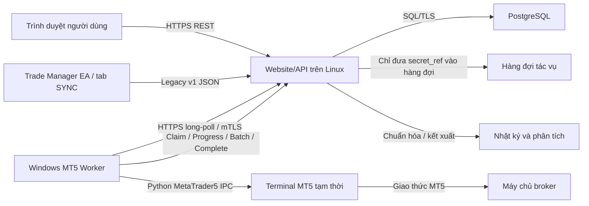

# GoldScalperNinja - Kế hoạch nhập lịch sử MT5 theo yêu cầu

## 1. Mục tiêu

Xây dựng chức năng cho phép người dùng trên website GoldScalperNinja bấm `IMPORT MT5 HISTORY` để lấy lịch sử giao dịch trực tiếp từ tài khoản MT5.

Kiến trúc giai đoạn đầu gồm:

- Một Linux VPS chạy website, API và cơ sở dữ liệu.
- Một Windows VPS làm MT5 Import Worker.
- Một terminal MT5 được khởi động theo từng tác vụ nhập dữ liệu.
- `concurrency = 1`: mỗi thời điểm chỉ xử lý một tài khoản.
- MT5 không chạy thường trực; terminal chỉ mở khi có tác vụ và được đóng sau khi dọn dẹp.

Mục tiêu sản phẩm:

- Người dùng không cần tự mở MT5.
- Người dùng không cần cài EA để nhập lịch sử cũ.
- Website nhận đủ orders, deals và dữ liệu cần thiết để tạo nhật ký giao dịch.
- Không dùng mật khẩu giao dịch chính; ưu tiên Investor Password chỉ đọc.
- Không để lộ thông tin xác thực trên trình duyệt, hàng đợi, log hoặc giao diện Admin.
- Có thể thử lại tác vụ mà không tạo dữ liệu trùng.
- Một Windows VPS có thể phục vụ nhiều người dùng bằng hàng đợi tuần tự.
- Khi VPS bị mất, có thể dựng máy thay thế từ bootstrap mà không thay đổi đặc tả API.

## 2. Phạm vi và các nội dung chưa triển khai

### 2.1 Trong phạm vi

- Lưu kết nối tài khoản MT5 của người dùng.
- Tạo tác vụ nhập dữ liệu thủ công từ website.
- Khởi động terminal MT5 ẩn hoặc thu nhỏ trên Windows.
- Đăng nhập bằng số tài khoản, Investor Password và máy chủ broker.
- Lấy `history_orders_get()` và `history_deals_get()`.
- Chuẩn hóa và tải dữ liệu theo lô về backend.
- Tạo dữ liệu nhật ký từ orders/deals sau khi nhập.
- Hiển thị tiến độ, lỗi và kết quả.
- Đóng tiến trình MT5 và xóa dữ liệu tạm sau tác vụ.
- Admin quản lý Worker, tác vụ, tính tương thích broker và audit.
- Dựng lại Windows VPS bằng bộ bootstrap có cấu trúc đường dẫn cố định.

### 2.2 Chưa triển khai trong MVP

- Đặt, sửa hoặc đóng lệnh từ website.
- Lưu mật khẩu giao dịch chính.
- Chạy nhiều terminal đồng thời trên cùng Worker.
- Đồng bộ vị thế đang mở theo thời gian thực bằng bộ nhập lịch sử.
- Kết nối MetaTrader Manager API của broker.
- Thu thập dữ liệu từ MT5 Web Terminal.

## 3. Kiến trúc tổng quan



Nguyên tắc:

- Trình duyệt chỉ giao tiếp với backend website.
- Backend không mở kết nối trực tiếp đến cổng công khai trên Windows VPS.
- Worker chủ động thăm dò và nhận tác vụ qua kết nối đi ra ngoài.
- Hàng đợi không chứa mật khẩu dạng rõ.
- Terminal chỉ tồn tại trong vòng đời của một tác vụ.
- Cơ sở dữ liệu backend là nguồn dữ liệu chuẩn.
- Website định tuyến theo `worker_id`; không lưu đường dẫn `C:\...` của Windows.

## 4. Thành phần và trách nhiệm

| Thành phần | Trách nhiệm | Giao tiếp |
|---|---|---|
| Web Frontend | Biểu mẫu tài khoản, nút nhập, tiến độ, kết quả | HTTPS REST/SSE |
| Public API | Xác thực người dùng, kiểm tra đầu vào, tạo tác vụ | HTTPS JSON |
| Legacy EA Adapter | Nhận heartbeat và dữ liệu giao dịch đóng từ tab SYNC | HTTPS JSON + `X-API-Key` |
| Import Orchestrator | Hàng đợi, lease, retry, timeout, idempotency | PostgreSQL/Redis |
| Dịch vụ thông tin xác thực | Mã hóa, giải mã, cấp secret token một lần | API nội bộ |
| PostgreSQL | Tài khoản, tác vụ, orders, deals, audit | TLS SQL |
| Windows Worker | Nhận tác vụ, điều khiển terminal, tải lô dữ liệu | HTTPS đi ra ngoài |
| Terminal Slot Manager | Tạo slot, theo dõi PID, dọn dẹp | Windows process API |
| MT5 Python Connector | Đăng nhập, xác minh tài khoản, lấy lịch sử | `MetaTrader5` IPC |
| Journal Projector | Chuyển orders/deals thành nhật ký giao dịch | Tác vụ bất đồng bộ |
| Admin Console | Theo dõi Worker, tác vụ, lỗi và audit | Admin API |

## 5. Mô hình giao tiếp và đặc tả dữ liệu

### 5.1 Trình duyệt -> Backend

- Dùng HTTPS REST JSON.
- Xác thực bằng session hoặc access token của website.
- Bảo vệ CSRF nếu session dùng cookie.
- Trình duyệt không giao tiếp trực tiếp với Windows Worker.
- API không bao giờ trả lại Investor Password sau khi lưu.

### 5.2 Backend -> Hàng đợi/Cơ sở dữ liệu

- MVP có thể dùng PostgreSQL với `SELECT ... FOR UPDATE SKIP LOCKED`.
- Chỉ cần Redis/BullMQ/Celery khi tải tăng đáng kể.
- Nội dung hàng đợi chỉ chứa `account_id`, `job_id`, khoảng thời gian và `secret_ref`.
- Không đưa mật khẩu, access token hoặc snapshot tài khoản đầy đủ vào hàng đợi.

### 5.3 Windows Worker -> Backend

- Worker long-poll mỗi 2 đến 5 giây.
- Worker nhận tác vụ bằng lease có thời hạn.
- Môi trường production dùng mTLS hoặc Worker JWT ngắn hạn.
- Request thay đổi trạng thái phải có khóa idempotency.
- Worker chỉ được xem là online khi backend nhận heartbeat hợp lệ.

Không khuyến nghị backend gọi trực tiếp vào cổng công khai của Windows VPS vì làm tăng bề mặt tấn công, độ phức tạp firewall và vấn đề NAT.

### 5.4 Worker -> MT5 -> Broker

- Worker khởi động terminal từ slot riêng.
- Python truyền `login`, `password`, `server` và `portable=True` vào `initialize()`.
- Sau khi kết nối, bắt buộc xác minh `account_info().login` và tên máy chủ.
- MT5 tự kết nối đến máy chủ giao dịch của broker.
- Tên máy chủ broker chính xác là dữ liệu bắt buộc.

### 5.5 Đặc tả hiện tại của tab SYNC - Legacy v1

Nguồn chính xác của đặc tả hiện tại:

```text
GoldScalperNinja - TradeManager/Include/GSN_TradeSync_Engine.mqh
```

Đây là đặc tả tương thích ngược cho EA đang triển khai, không phải đặc tả mục tiêu của bộ nhập lịch sử trên Windows.

#### 5.5.1 Xác thực

Các input liên quan:

```text
InpSyncApiKey
InpSyncApiUrl
```

Header:

```http
Content-Type: application/json
X-API-Key: <InpSyncApiKey>
```

Lệnh từ xa có thêm:

```http
X-Account-Number: <MT5 account login>
```

Lưu ý:

- URL mặc định trong EA hiện là `http://127.0.0.1:3000`.
- Môi trường production phải chuyển sang HTTPS.
- Mã hiện tại ghi 8 ký tự đầu của API key vào log khi khởi tạo; cần loại bỏ trước khi đưa vào production.

#### 5.5.2 Heartbeat

```http
POST {baseUrl}/api/ea/heartbeat
Content-Type: application/json
X-API-Key: <api-key>
Timeout: 2000 ms
```

```json
{
  "eaVersion": "1.05",
  "accountNumber": "12345678",
  "balance": 10000.25,
  "equity": 10042.70,
  "broker": "Example Broker Ltd",
  "server": "ExampleBroker-Live02",
  "currency": "USD",
  "leverage": 500,
  "gmtOffset": 10800
}
```

| Trường | Nguồn |
|---|---|
| `eaVersion` | Giá trị cố định `1.05` |
| `accountNumber` | `ACCOUNT_LOGIN`, chuỗi |
| `balance` | `ACCOUNT_BALANCE` |
| `equity` | `ACCOUNT_EQUITY` |
| `broker` | `ACCOUNT_COMPANY` |
| `server` | `ACCOUNT_SERVER` |
| `currency` | `ACCOUNT_CURRENCY` |
| `leverage` | `ACCOUNT_LEVERAGE` |
| `gmtOffset` | `TimeCurrent() - TimeGMT()` theo giây |

Xử lý phản hồi:

- `200`: kết nối thành công.
- `401`: API key không hợp lệ.
- `403`: API key không khớp tài khoản.
- `-1`: lỗi MT5 WebRequest.
- Nội dung phản hồi thành công hiện không được parse.

#### 5.5.3 Đồng bộ giao dịch đã đóng

```http
POST {baseUrl}/api/ea/trades
Content-Type: application/json
X-API-Key: <api-key>
Timeout: 2000 ms
```

```json
{
  "trades": [
    {
      "ticket": "987654321",
      "symbol": "XAUUSD",
      "type": 0,
      "volume": 0.10,
      "openPrice": 4098.25000,
      "openTime": 1783731600,
      "closePrice": 4105.75000,
      "closeTime": 1783735200,
      "stopLoss": 4092.00000,
      "takeProfit": 4106.00000,
      "profit": 75.00,
      "commission": -0.70,
      "swap": 0.00
    }
  ],
  "eaVersion": "1.05",
  "clientTime": "2026.07.11 19:20:00",
  "accountNumber": "12345678"
}
```

Ý nghĩa quan trọng:

| Trường | Ý nghĩa hiện tại |
|---|---|
| `ticket` | `DEAL_POSITION_ID`, không phải ticket của closing deal |
| `type` | `0 = BUY`, `1 = SELL`, suy ra từ opening deal |
| `volume` | Volume của closing deal, cố định 2 chữ số thập phân |
| `openPrice/openTime` | Opening deal đầu tiên tìm được |
| `closePrice/closeTime` | Closing deal hiện tại |
| `stopLoss/takeProfit` | Giá trị trên closing deal; fallback về order gần nhất |
| `profit/commission/swap` | Giá trị của closing deal |

Chỉ các deal có `DEAL_ENTRY_OUT` hoặc `DEAL_ENTRY_INOUT` được gửi. Endpoint này không gửi vị thế đang mở.

#### 5.5.4 Cách kích hoạt đồng bộ

1. Chọn khoảng thời gian thủ công.
2. Chọn khoảng ngày tùy chỉnh.
3. Đồng bộ toàn bộ lịch sử, tối đa 100 giao dịch mỗi lô và chờ 20 giây giữa các lô.
4. Phát hiện tự động bằng `OnTradeTransaction` và `OnTick`.

`OnTradeTransaction` đưa closing deal ticket vào hàng đợi CSV trong `FILE_COMMON`. Global Variable theo tài khoản giúp tránh nhiều biểu đồ cùng xử lý hàng đợi.

#### 5.5.5 Lệnh điều khiển từ xa

Worker EA thăm dò mỗi 5 giây:

```http
GET {baseUrl}/api/ea/commands/pending?accountNumber=12345678
X-API-Key: <api-key>
X-Account-Number: 12345678
Content-Type: application/json
```

```json
{
  "id": "cmd_123",
  "type": "SYNC_TRADES",
  "params": {
    "days": 30,
    "fromDate": "2026.06.01",
    "toDate": "2026.06.30"
  }
}
```

Các loại hiện hỗ trợ:

```text
SYNC_TRADES
SYNC_ALL
TEST_CONNECTION
```

Báo cáo kết quả:

```http
PATCH {baseUrl}/api/ea/commands/{commandId}
X-API-Key: <api-key>
X-Account-Number: <account-number>
```

```json
{
  "status": "COMPLETED",
  "result": {
    "success": true,
    "message": "Synced 24 trades successfully",
    "syncedCount": 24
  }
}
```

#### 5.5.6 Hạn chế của Legacy v1

1. Tên UI “Sync Your Positions” gây hiểu nhầm; mã chỉ gửi giao dịch đã đóng.
2. `ticket` là position ID nên các lần partial close có thể trùng ID.
3. Không gửi riêng `dealTicket`, `orderTicket`, `positionId` và `time_msc`.
4. Không gửi `fee`, `magic`, `reason`, `entry`, broker và server trong trade payload.
5. Giá cố định 5 chữ số và volume 2 chữ số có thể làm mất độ chính xác.
6. `SyncDateRange()` gom toàn bộ khoảng vào một yêu cầu, có nguy cơ payload lớn.
7. Hai luồng tự động có thể gửi trùng cùng closing deal.
8. `g_LastHistoryTotal = 0` có thể làm lần quét đầu xử lý lại lịch sử cũ.
9. Fallback direction ở date-range/all-history không đảo chiều closing deal giống `BuildTradeJson()`.
10. Parser lệnh dùng tìm chuỗi, không phải parser JSON hoàn chỉnh.
11. Message báo cáo lệnh chưa escape JSON đầy đủ.
12. API key có thể xuất hiện trong input và log.
13. Chưa bắt buộc TLS trong môi trường production.
14. Phản hồi thành công chưa có đặc tả xác nhận idempotency.

### 5.6 Chiến lược đặc tả mục tiêu

Giữ hai adapter riêng:

```text
EA_SYNC_V1
  -> Legacy Trade Adapter
  -> Canonical Journal Model

WINDOWS_IMPORT_V2
  -> Raw Orders/Deals Adapter
  -> Canonical MT5 Tables
  -> Canonical Journal Model
```

Adapter Legacy phải tiếp tục nhận payload hiện tại để không phá EA đã cài. Windows importer phải gửi orders/deals thô để hỗ trợ partial close, hedging, netting, sửa chữa và audit.

### 5.7 Đặc tả sự kiện EA v2 trong tương lai

```http
POST /v2/ea/trade-events
```

```json
{
  "schemaVersion": "2.0",
  "source": "EA_SYNC_V2",
  "account": {
    "login": "12345678",
    "broker": "Example Broker Ltd",
    "server": "ExampleBroker-Live02",
    "currency": "USD"
  },
  "client": {
    "eaVersion": "future-version",
    "sentAtUtc": "2026-07-11T12:20:00Z"
  },
  "events": [
    {
      "dealTicket": "111222333",
      "orderTicket": "111222000",
      "positionId": "987654321",
      "entry": "OUT",
      "side": "SELL",
      "symbol": "XAUUSD",
      "volume": "0.010",
      "price": "4105.750",
      "timeMsc": 1783735200123,
      "profit": "7.50",
      "commission": "-0.07",
      "swap": "0.00",
      "fee": "0.00",
      "magic": 123456,
      "reason": "EXPERT",
      "sl": "4092.000",
      "tp": "4106.000"
    }
  ]
}
```

Yêu cầu: số thập phân dạng chuỗi, thời gian UTC, idempotency theo deal và phản hồi xác nhận từng sự kiện.

### 5.8 Đặc tả snapshot vị thế đang mở

Mã hiện tại chưa có yêu cầu đồng bộ vị thế đang mở. Không tái sử dụng `/api/ea/trades` cho mục đích này.

```http
POST /v2/ea/position-snapshots
Authorization: Bearer <short-lived-ea-token>
Idempotency-Key: <account-login>:<snapshot-id>
```

```json
{
  "schemaVersion": "2.0",
  "snapshotId": "12345678-1783735200123",
  "capturedAtUtc": "2026-07-11T12:20:00.123Z",
  "account": {
    "login": "12345678",
    "broker": "Example Broker Ltd",
    "server": "ExampleBroker-Live02",
    "currency": "USD",
    "marginMode": "HEDGING"
  },
  "positions": [
    {
      "positionTicket": "987654321",
      "symbol": "XAUUSD",
      "side": "BUY",
      "volume": "0.010",
      "openPrice": "4098.250",
      "openTimeMsc": 1783731600123,
      "currentPrice": "4105.750",
      "stopLoss": "4092.000",
      "takeProfit": "4106.000",
      "profit": "7.50",
      "swap": "0.00",
      "magic": 123456,
      "comment": "GSN Trade Manager",
      "reason": "EXPERT"
    }
  ]
}
```

Quy tắc đối soát:

1. Snapshot chỉ có hiệu lực cho đúng `login + broker + server`.
2. Upsert theo `positionTicket`, không dùng symbol làm khóa duy nhất.
3. Snapshot rỗng là hợp lệ nếu yêu cầu đã xác thực và mới hơn snapshot trước.
4. Snapshot không thay thế orders/deals và không dùng để tính realized P/L.
5. Backend lưu `snapshotId`, hash payload và thời điểm nhận để audit.

### 5.9 Tổng hợp định tuyến dữ liệu

| Nhu cầu | Endpoint | Ý nghĩa | Đích |
|---|---|---|---|
| Trạng thái EA/tài khoản | `POST /api/ea/heartbeat` | Chỉ số tại thời điểm heartbeat | Connection state |
| Giao dịch đóng Legacy | `POST /api/ea/trades` | Projection mất thông tin từ closing deals | Legacy adapter |
| Vị thế đang mở | `POST /v2/ea/position-snapshots` | Snapshot open exposure | Open-position read model |
| Sự kiện thực thi tương lai | `POST /v2/ea/trade-events` | Deal-level events | Canonical deals |
| Toàn bộ lịch sử | `POST /internal/v1/mt5-jobs/{jobId}/batches` | Orders/deals thô | Canonical orders/deals |

## 6. Luồng thao tác của người dùng

### 6.1 Thêm tài khoản MT5

Biểu mẫu gồm:

```text
Tên gợi nhớ
Số tài khoản
Tên broker
Tên máy chủ broker
Investor Password
Ngày bắt đầu nhập mặc định
Xác nhận đồng ý
```

Sau khi lưu:

- Mật khẩu được mã hóa ngay.
- API chỉ trả `has_credential: true` và thời điểm cập nhật.
- Không trả chuỗi che mật khẩu có cùng độ dài thật.
- Tài khoản ở trạng thái `UNVERIFIED` đến lần nhập đầu tiên thành công.

### 6.2 Tạo tác vụ nhập dữ liệu

1. Người dùng bấm `IMPORT HISTORY`.
2. Frontend gọi `POST /v1/mt5-accounts/{id}/imports`.
3. Backend kiểm tra quyền sở hữu, quota và trạng thái tài khoản.
4. Backend tạo tác vụ `QUEUED`, trả HTTP `202 Accepted`.
5. Worker nhận tác vụ.
6. Frontend theo dõi bằng polling hoặc SSE.
7. Worker mở MT5, đăng nhập, lấy dữ liệu và tải lên.
8. Backend nhập các lô theo cơ chế idempotent.
9. Journal Projector xây dựng nhật ký.
10. Worker dọn dẹp MT5.
11. Tác vụ chuyển sang `COMPLETED`.

### 6.3 Tiến độ hiển thị

```text
Đang chờ Worker
Đang khởi động MT5
Đang kết nối broker
Đang lấy orders
Đang lấy deals
Đang tải lô 3/8
Đang xây dựng nhật ký
Hoàn tất: đã nhập 142 giao dịch
```

Không hiển thị lỗi broker thô nếu có thể chứa thông tin tài khoản hoặc máy chủ nhạy cảm.

## 7. Máy trạng thái tác vụ

```text
QUEUED
  -> CLAIMED
  -> STARTING_TERMINAL
  -> AUTHENTICATING
  -> FETCHING_ORDERS
  -> FETCHING_DEALS
  -> UPLOADING
  -> PROJECTING_JOURNAL
  -> CLEANING_UP
  -> COMPLETED
```

Nhánh lỗi:

```text
Trạng thái đang hoạt động
  -> RETRYABLE_FAILED
  -> QUEUED

Trạng thái đang hoạt động
  -> CLEANING_UP
  -> FAILED

QUEUED/CLAIMED
  -> CANCELLED
```

Bất biến:

- Chỉ `COMPLETED` sau khi backend nhận đủ manifest và hoàn tất phần projection bắt buộc.
- `CLEANING_UP` phải chạy cho cả thành công, thất bại và hủy.
- Lease hết hạn có thể được nhận lại, nhưng tải lô phải idempotent.
- Không thử lại lỗi xác thực vô hạn.

## 8. Đặc tả API công khai

### 8.1 Lưu tài khoản

```http
POST /v1/mt5-accounts
Authorization: Bearer <user-token>
Idempotency-Key: <uuid>
Content-Type: application/json
```

```json
{
  "label": "My Gold Account",
  "login": "12345678",
  "broker_name": "Example Broker",
  "server": "ExampleBroker-Live02",
  "investor_password": "secret",
  "default_import_from": "2025-01-01T00:00:00Z",
  "consent": true
}
```

Phản hồi không chứa mật khẩu:

```json
{
  "id": "mta_123",
  "label": "My Gold Account",
  "login_masked": "****5678",
  "server": "ExampleBroker-Live02",
  "status": "UNVERIFIED",
  "has_credential": true
}
```

### 8.2 Tạo tác vụ nhập

```http
POST /v1/mt5-accounts/{accountId}/imports
Authorization: Bearer <user-token>
Idempotency-Key: <uuid>
```

```json
{
  "from": "2025-01-01T00:00:00Z",
  "to": "2026-07-11T12:00:00Z",
  "mode": "FULL"
}
```

Các mode:

- `FULL`: nhập toàn bộ khoảng đã chọn.
- `INCREMENTAL`: nhập từ cursor gần nhất với cửa sổ chồng lấn.
- `REPAIR`: nhập lại khoảng nghi ngờ thiếu dữ liệu.

### 8.3 Xem trạng thái

```http
GET /v1/imports/{jobId}
Authorization: Bearer <user-token>
```

```json
{
  "job_id": "imp_123",
  "status": "UPLOADING",
  "progress_percent": 72,
  "message": "Uploading history batches",
  "orders_received": 520,
  "deals_received": 344,
  "trades_projected": 120
}
```

### 8.4 Hủy tác vụ

```http
POST /v1/imports/{jobId}/cancel
Authorization: Bearer <user-token>
```

Việc hủy mang tính phối hợp. Worker kiểm tra trạng thái hủy giữa các giai đoạn và vẫn phải dọn dẹp terminal.

## 9. API nội bộ dành cho Worker

### 9.1 Heartbeat và nhận tác vụ

```http
POST /internal/v1/mt5-workers/heartbeat
POST /internal/v1/mt5-jobs/claim
Authorization: Worker <short-lived-token>
```

Claim trả `job_id`, `lease_id`, thời điểm hết hạn, tài khoản, khoảng thời gian và `secret_exchange_token`.

### 9.2 Trao đổi thông tin đăng nhập

```http
POST /internal/v1/mt5-jobs/{jobId}/secret
Authorization: Worker <short-lived-token>
```

Token phải:

- Chỉ dùng một lần.
- Có TTL ngắn.
- Gắn với `job_id`, `lease_id` và `worker_id`.
- Bị thu hồi khi hủy hoặc lease hết hạn.

### 9.3 Tiến độ và lô dữ liệu

```http
POST /internal/v1/mt5-jobs/{jobId}/progress
POST /internal/v1/mt5-jobs/{jobId}/batches
Idempotency-Key: <job-id:entity-type:batch-index:checksum>
Content-Encoding: gzip
```

Lô gồm `ORDERS` hoặc `DEALS`, chỉ số lô, tổng số lô, checksum và danh sách bản ghi.

### 9.4 Hoàn tất hoặc thất bại

```http
POST /internal/v1/mt5-jobs/{jobId}/complete
POST /internal/v1/mt5-jobs/{jobId}/fail
```

Backend chỉ chấp nhận `complete` khi đã nhận đủ manifest.

## 10. Lược đồ cơ sở dữ liệu đề xuất

Các bảng chính:

```text
mt5_accounts
  id, user_id, label
  broker_name, broker_server
  login_hash, login_encrypted, login_last_four
  status, credential_id
  last_verified_at, last_imported_at
  incremental_cursor_time
  created_at, updated_at, deleted_at

mt5_credentials
  id, encrypted_secret, encryption_key_version
  credential_type, status
  rotated_at, revoked_at, created_at

mt5_import_jobs
  id, user_id, mt5_account_id
  mode, range_from, range_to
  status, progress_percent
  worker_id, lease_id, lease_expires_at
  order_count, deal_count, projected_count
  public_error_code, internal_error_detail
  created_at, started_at, completed_at, updated_at

mt5_worker_attempts
  id, job_id, worker_id, attempt_number
  started_at, heartbeat_at, ended_at
  terminal_pid, cleanup_status, error_code

mt5_orders
  account_id, order_ticket, position_id
  type, state, reason, magic
  symbol, volume_initial, volume_current
  price_open, sl, tp
  time_setup_msc, time_done_msc
  raw_payload, source

mt5_deals
  account_id, deal_ticket, order_ticket, position_id
  entry, type, reason, magic
  symbol, volume, price
  profit, commission, swap, fee
  time_msc, raw_payload, source
```

Khóa logic:

- Tài khoản: `user_id + broker_server + login_hash`.
- Order: `account_id + order_ticket`.
- Deal: `account_id + deal_ticket`.
- Batch: `job_id + entity_type + batch_index`.

## 11. Thiết kế Worker Windows

### 11.1 Vòng lặp Worker

```text
heartbeat
  -> claim job
  -> exchange secret
  -> create terminal slot
  -> initialize MT5
  -> verify account/server
  -> fetch orders
  -> fetch deals
  -> upload batches
  -> shutdown and cleanup
  -> complete/fail
```

### 11.2 Xử lý tiến trình

- Ghi nhận danh sách PID của đúng `terminal64.exe` trước khi khởi động.
- Sau `mt5.shutdown()`, chỉ dừng PID mới thuộc đúng đường dẫn terminal được kiểm soát.
- Không kill terminal MT5 khác của người dùng.
- Luôn dọn dẹp trong `finally`.
- Chỉ báo `COMPLETED` sau khi dọn dẹp.

### 11.3 Terminal slot

- Mỗi Worker MVP có một slot.
- Terminal nằm dưới `C:\GSN`, không nằm trong `Program Files` khi chạy portable.
- Slot tạm phải có quyền ghi cho tài khoản Worker.
- Dọn file tạm sau cả thành công và thất bại.

### 11.4 Windows session

Kiến trúc hiện tại dùng Scheduled Task `ONLOGON` vì MT5 cần session tương tác. Không mặc định chạy terminal trong session 0 của `SYSTEM` nếu chưa có bằng chứng tương thích.

## 12. Lấy và chuẩn hóa lịch sử

### 12.1 Lấy cả orders và deals

Không chỉ lấy closed positions. Orders cung cấp vòng đời lệnh; deals cung cấp các lần khớp, partial close, phí và P/L.

### 12.2 Thời gian

- Đặc tả dùng UTC.
- Lưu `time_msc` nếu MT5 cung cấp.
- Không suy diễn GMT offset của broker khi đã có epoch timestamp.

### 12.3 Số thập phân

- Truyền giá, volume và tiền dưới dạng chuỗi thập phân trong đặc tả v2.
- Không cố định 5 chữ số cho mọi symbol.
- Không cố định 2 chữ số cho mọi volume step.

### 12.4 Journal projection

Projection phải xử lý:

- Nhiều entry cho cùng position.
- Partial close.
- `DEAL_ENTRY_INOUT`.
- Hedging và netting.
- Commission, swap, fee.
- Deposit/withdrawal không được xem là giao dịch thị trường.

Raw orders/deals là nguồn dữ liệu chuẩn; journal có thể rebuild.

## 13. Thiết kế bảo mật

### 13.1 Chính sách thông tin xác thực

- Chỉ nhận Investor Password trong MVP.
- Không hiển thị lại mật khẩu.
- Cho phép thay đổi và thu hồi thông tin xác thực.
- Không ghi mật khẩu vào log, crash dump, queue hoặc artifact.

### 13.2 Mã hóa khi lưu

- Môi trường production dùng KMS/Vault và envelope encryption.
- Khóa mã hóa không nằm cùng cơ sở dữ liệu.
- Hỗ trợ rotation theo `encryption_key_version`.

### 13.3 Truyền bí mật

- Chỉ truyền sau khi Worker nhận lease hợp lệ.
- Dùng token một lần, TTL ngắn.
- Môi trường production dùng HTTPS/mTLS.
- Worker giữ mật khẩu trong bộ nhớ trong thời gian ngắn nhất.

### 13.4 Cô lập tenant

- Mọi API người dùng kiểm tra `user_id`.
- Worker không tự chọn tài khoản ngoài tác vụ.
- Admin log phải che số tài khoản và thông tin nhạy cảm.

### 13.5 Gia cố Windows

- Dùng tài khoản Windows chuyên dụng, không dùng cho duyệt web.
- ACL `C:\GSN` chỉ cho Worker, Administrator và SYSTEM.
- Bật cập nhật hệ điều hành và Defender.
- Không thêm ngoại lệ antivirus toàn bộ ổ đĩa.
- Giới hạn RDP bằng VPN hoặc allowlist.

### 13.6 Các mối đe dọa cần ngăn chặn

- Đánh cắp Investor Password.
- Replay enrollment token hoặc batch.
- Worker giả mạo.
- Upload sau khi lease hết hạn.
- Cross-tenant access.
- Payload quá lớn hoặc gzip bomb.
- Path traversal và xóa nhầm thư mục.
- VPS cũ tiếp tục hoạt động sau khi đã thay máy.

## 14. Độ tin cậy và khôi phục

### 14.1 Lease

- Lease có thời hạn và được gia hạn qua progress/batch.
- Worker mất heartbeat làm tác vụ quay lại hàng đợi sau timeout.
- Tác vụ hoàn tất/thất bại không được reclaim.

### 14.2 Chính sách thử lại

Có thể thử lại:

- Mất mạng tạm thời.
- Backend `5xx`.
- Upload timeout.
- Broker tạm không khả dụng.

Không tự động thử lại vô hạn:

- Sai mật khẩu.
- Sai máy chủ.
- Tài khoản không khớp.
- Payload/schema không hợp lệ.

### 14.3 Tiếp tục lô dữ liệu

- Backend lưu checksum từng lô.
- Gửi lại cùng checksum trả thành công idempotent.
- Cùng chỉ số nhưng checksum khác trả `409`.
- Complete chỉ thành công khi đủ lô từ `0..N-1` cho cả orders và deals.

### 14.4 Khôi phục sau crash

- Worker dọn tiến trình terminal mồ côi khi khởi động.
- Tác vụ hết lease được nhận lại.
- Admin có thể retry, cancel hoặc revoke Worker.
- VPS thay thế đăng ký identity mới; identity cũ phải bị thu hồi.

## 15. Năng lực của một Windows VPS

Cấu hình MVP:

```text
worker_count = 1
terminal_slots = 1
max_concurrency = 1
```

Cần áp dụng:

- Tối đa một tác vụ đang chạy trên mỗi Worker.
- Giới hạn khoảng lịch sử theo gói người dùng.
- Lô 500 đến 2.000 bản ghi, cần benchmark.
- Timeout tác vụ có cấu hình.
- Hiển thị vị trí hàng đợi.
- Backpressure khi Worker offline.

Khi mở rộng, có thể thêm Worker thứ hai mà không đổi public API.

## 16. Admin và khả năng quan sát

### 16.1 Bảng điều khiển Worker

Hiển thị:

```text
Online/offline/revoked
Phiên bản Worker
Heartbeat gần nhất
Tác vụ hiện tại
Trạng thái slot và PID terminal
CPU, RAM, disk
Số tác vụ thành công/thất bại 24 giờ
Thời gian trung bình/P95
Kết quả dọn dẹp gần nhất
```

### 16.2 Chi tiết tác vụ

- Người dùng và tài khoản đã che.
- Broker/máy chủ.
- Khoảng và mode.
- Timeline trạng thái.
- Attempt và Worker.
- Số bản ghi/lô.
- Lỗi công khai và lỗi nội bộ đã che.
- Kết quả projection.
- Bằng chứng dọn dẹp terminal.

### 16.3 Cảnh báo

- Mất heartbeat Worker.
- Hàng đợi hoặc tác vụ chờ vượt ngưỡng.
- Terminal mồ côi.
- Cleanup thất bại.
- Lỗi xác thực tăng bất thường.
- Disk/RAM cao.
- Tỷ lệ duplicate/conflict tăng.

## 17. Mã lỗi chuẩn

```text
MT5_INVALID_CREDENTIAL
MT5_UNKNOWN_SERVER
MT5_CONNECT_TIMEOUT
MT5_ACCOUNT_MISMATCH
MT5_TERMINAL_START_FAILED
MT5_TERMINAL_EXIT_FAILED
MT5_HISTORY_FETCH_FAILED
MT5_HISTORY_INCOMPLETE
WORKER_OFFLINE
WORKER_LEASE_EXPIRED
IMPORT_CANCELLED
IMPORT_TIMEOUT
BATCH_CHECKSUM_MISMATCH
UPLOAD_FAILED
JOURNAL_PROJECTION_FAILED
INTERNAL_ERROR
```

Mỗi lỗi có thông điệp an toàn cho người dùng, chi tiết nội bộ đã che, cờ retryable, giai đoạn và attempt ID.

## 18. Quyền riêng tư và lưu giữ dữ liệu

- Người dùng phải đồng ý trước khi lưu thông tin xác thực.
- Cho phép ngắt kết nối và yêu cầu xóa dữ liệu.
- Xóa thông tin xác thực sớm nhất khi không còn cần.
- Đặt retention rõ ràng cho raw MT5 data.
- Xóa file tạm trên Worker ngay sau khi dọn dẹp.
- Artifact chẩn đoán có TTL ngắn và được mã hóa.
- Chỉ hiển thị bốn số cuối của tài khoản trong UI/log.
- Không dùng lịch sử người dùng để huấn luyện AI nếu chưa có đồng ý riêng.

## 19. Các giai đoạn triển khai

### Giai đoạn 0 - Thử nghiệm tính khả thi

- Một Windows VPS kiểm thử.
- Một terminal slot portable.
- Kết nối bằng Investor Password.
- Lấy orders/deals từ các broker mục tiêu.
- Xác minh việc dọn dẹp tiến trình và không lộ mật khẩu.

### Giai đoạn 1 - Worker Windows MVP

- Identity, enrollment và heartbeat.
- Claim/lease.
- Secret exchange.
- Fetch/upload theo lô.
- Cleanup/watchdog.
- Log có cấu trúc và đã che dữ liệu.

### Giai đoạn 2 - Backend nhập dữ liệu

- API tài khoản/thông tin xác thực.
- Orchestrator và lease.
- PostgreSQL migrations.
- Batch idempotency.
- Progress, retry và cancel.

### Giai đoạn 3 - Trải nghiệm website

- Biểu mẫu kết nối MT5.
- Cảnh báo Investor Password.
- Nút nhập dữ liệu.
- Tiến độ, lỗi, retry và ngắt kết nối.

### Giai đoạn 4 - Nhật ký giao dịch

- Chuẩn hóa orders/deals.
- Projection position/trade.
- Partial close, hedging và netting.
- Repair/rebuild.

### Giai đoạn 5 - Gia cố bảo mật

- KMS/Vault.
- mTLS.
- Windows hardening.
- Kiểm thử xâm nhập.
- Rotation và retention.

### Giai đoạn 6 - Mở rộng và vận hành

- Dashboard Admin.
- Cảnh báo/SLO.
- Registry tương thích broker.
- Benchmark và nhiều Worker.

## 20. Kế hoạch kiểm thử

### 20.1 Kiểm thử đơn vị

- Chuyển trạng thái tác vụ.
- Lease hết hạn/gia hạn.
- Token TTL, binding và single-use.
- Chuẩn hóa bản ghi MT5.
- Upsert idempotent.
- Projection và che lỗi.

### 20.2 Kiểm thử tích hợp

- Claim -> secret -> progress -> batch -> complete.
- Sai mật khẩu hoặc sai máy chủ.
- Worker crash khi fetch/upload.
- Backend `500` khi upload.
- Lô trùng, sai thứ tự hoặc checksum xung đột.
- Hủy ở mọi giai đoạn.
- Terminal không chịu đóng.

### 20.3 Kiểm thử đầu cuối

- Lưu tài khoản -> nhập -> xem dữ liệu.
- Full rồi incremental import.
- Partial close.
- Hedging và netting.
- Nhiều symbol/currency.
- Commission, swap và fee.
- Nhiều người dùng trong hàng đợi.

### 20.4 Kiểm thử bảo mật

- Tìm mật khẩu dạng rõ trong DB, log, temp và crash report.
- Thử truy cập chéo tenant.
- Replay secret token và batch.
- Upload bằng lease hết hạn.
- Thu hồi Worker.
- Payload quá lớn và gzip bomb.

### 20.5 Kiểm thử sự cố

- Khởi động lại VPS khi đang xử lý.
- Kill terminal.
- Mất mạng.
- Broker không khả dụng.
- Database restart.
- Disk gần đầy.

## 21. Tiêu chí nghiệm thu MVP

1. Người dùng tạo được tác vụ nhập từ website.
2. Một Windows VPS và một slot xử lý tuần tự.
3. MT5 chỉ khởi động khi có tác vụ.
4. Worker đăng nhập bằng Investor Password và đúng máy chủ.
5. Worker xác minh đúng tài khoản trước khi lấy dữ liệu.
6. Orders/deals được nhập đủ theo khoảng.
7. Retry không tạo duplicate.
8. Người dùng xem được tiến độ và lỗi an toàn.
9. Nhật ký được tạo từ dữ liệu đã nhập.
10. `mt5.shutdown()` và dọn dẹp PID luôn chạy.
11. Không còn terminal mới sau khi thành công, thất bại hoặc hủy.
12. Hàng đợi không chứa mật khẩu dạng rõ.
13. Browser/Admin không đọc lại mật khẩu.
14. Chặn truy cập chéo người dùng.
15. Worker offline không làm mất tác vụ.
16. Admin xem được Worker, lần thực thi và kết quả dọn dẹp.
17. Audit log ghi thao tác tài khoản, thông tin xác thực và nhập dữ liệu.
18. Kiểm thử không tìm thấy mật khẩu trong artifact lâu dài.
19. Broker compatibility gate đạt với broker mục tiêu.
20. Có bài diễn tập thay VPS và thu hồi identity cũ.

## 22. Ranh giới repository đề xuất

```text
website/
  apps/web/
  services/mt5-import-orchestrator/
  services/journal-projector/
  packages/mt5-import-contracts/
  migrations/

windows-worker/
  worker/
    api_client/
    job_runner/
    terminal_slots/
    mt5_connector/
    normalization/
    security/
    telemetry/
  tests/
  installer/

docs/
  MT5_ON_DEMAND_HISTORY_IMPORT_PLAN.md
  broker-compatibility-matrix.md
  runbooks/
```

Đặc tả dùng chung nên được sinh từ OpenAPI/JSON Schema để backend và Worker không lệch trường dữ liệu, trạng thái hoặc mã lỗi.

## 23. Runbook vận hành cần có

- Worker offline.
- Terminal mồ côi.
- Lỗi thông tin xác thực tăng đột biến.
- Broker đổi tên máy chủ.
- Tác vụ kẹt hoặc lease hết hạn.
- Batch checksum conflict.
- Thu hồi thông tin xác thực/Worker.
- Thay Windows VPS.
- Khôi phục chứng chỉ Worker.

## 24. Các quyết định còn mở

1. Framework/backend hiện tại của website là gì?
2. PostgreSQL và Redis đã có chưa?
3. Dùng KMS/Vault nào?
4. Broker mục tiêu đầu tiên là broker nào?
5. Lưu Investor Password hay chỉ dùng cho từng lần nhập?
6. Raw orders/deals được giữ bao lâu?
7. Quota nhập theo gói là bao nhiêu?
8. Định nghĩa một giao dịch trong journal khi partial close như thế nào?
9. Windows VPS có fixed IP/VPN và user session chuyên dụng không?
10. Có cần đồng bộ incremental định kỳ trong tương lai không?

## 25. Khuyến nghị cuối cùng

Thứ tự triển khai:

```text
Kiểm thử broker/terminal
  -> Worker một slot
  -> Backend nhập dữ liệu
  -> Giao diện website
  -> Journal projection
  -> Gia cố bảo mật
  -> Vận hành và mở rộng
```

Không bắt đầu bằng multi-worker hoặc đồng bộ thời gian thực. Cần chứng minh trước bốn việc: vòng đời terminal, tính tương thích broker, độ đầy đủ dữ liệu và an toàn thông tin xác thực.

## 26. Tài liệu tham khảo chính thức

- Python `initialize()`: https://www.mql5.com/en/docs/python_metatrader5/mt5initialize_py
- Python `shutdown()`: https://www.mql5.com/en/docs/python_metatrader5/mt5shutdown_py
- Python `history_deals_get()`: https://www.mql5.com/en/docs/python_metatrader5/mt5historydealsget_py
- MT5 portable mode: https://www.metatrader5.com/en/terminal/help/start_advanced/start
- MT5 Investor authorization: https://www.metatrader5.com/en/terminal/help/startworking/authorization
- Tailscale Serve: https://tailscale.com/docs/reference/tailscale-cli/serve

## 27. Các phần quan trọng còn thiếu trước khi đưa vào production

1. OpenAPI và JSON Schema version hóa cho toàn bộ API.
2. PostgreSQL migrations và transaction upsert thực tế.
3. Journal projection đầy đủ cho partial close/hedging/netting.
4. Đối soát dữ liệu giữa `EA_SYNC_V1`, `EA_SYNC_V2` và `WINDOWS_IMPORT_V2`.
5. Worker enrollment bằng chứng chỉ hoặc JWT dành cho production.
6. Registry terminal/broker được hỗ trợ.
7. KMS/Vault và luân chuyển thông tin xác thực.
8. Batch manifest, giới hạn payload và cơ chế tiếp tục trong production.
9. Cấu hình môi trường, monitoring, log rotation và alert.
10. Bộ fixture broker và compatibility matrix.
11. Sender MQL5 cho position snapshot nếu cần open exposure.
12. Admin drain/disable/retry/cancel/dead-letter.

## 28. Mức độ sẵn sàng kiểm thử cục bộ

### 28.1 Hai mức kiểm thử

| Mức | Chứng minh được | Chưa chứng minh |
|---|---|---|
| A. Legacy EA SYNC | Heartbeat và JSON giao dịch đóng | Investor login, full raw history, open positions |
| B. Vertical slice theo yêu cầu | API tạo tác vụ, Worker đăng nhập MT5, tải lịch sử | Bảo mật production, mở rộng và nhiều broker |

### 28.2 Điều kiện kiểm thử tab SYNC Legacy

- Local API có `/api/ea/heartbeat` và `/api/ea/trades`.
- API kiểm tra `X-API-Key` và account mapping.
- MT5 cho phép URL trong danh sách WebRequest.
- Có ít nhất một closing deal.
- Gửi lại payload không tạo duplicate logic.

### 28.3 Điều kiện kiểm thử on-demand importer

Backend tối thiểu:

```text
POST /v1/mt5-accounts
POST /v1/mt5-accounts/{accountId}/imports
GET  /v1/imports/{jobId}
POST /internal/v1/mt5-workers/heartbeat
POST /internal/v1/mt5-jobs/claim
POST /internal/v1/mt5-jobs/{jobId}/secret
POST /internal/v1/mt5-jobs/{jobId}/progress
POST /internal/v1/mt5-jobs/{jobId}/batches
POST /internal/v1/mt5-jobs/{jobId}/complete
POST /internal/v1/mt5-jobs/{jobId}/fail
```

Worker tối thiểu:

- Cấu hình backend URL, Worker ID và terminal path.
- Enrollment và token store.
- Claim/lease.
- Khởi tạo MT5 và xác minh tài khoản/máy chủ.
- Lấy orders/deals.
- Chuẩn hóa, checksum, gzip và upload.
- Cập nhật tiến độ, hoàn tất/thất bại và dọn dẹp.

### 28.4 Định nghĩa hoàn tất cho kiểm thử PC

- [ ] API và cơ sở dữ liệu khởi động từ script.
- [ ] Worker heartbeat và nhận tác vụ.
- [ ] Mật khẩu không xuất hiện dạng rõ trong DB/log/temp.
- [ ] Worker từ chối tài khoản/máy chủ không khớp.
- [ ] Orders/deals tải đủ theo khoảng.
- [ ] Replay lô không tạo duplicate.
- [ ] Tác vụ đạt `COMPLETED` hoặc mã lỗi đúng.
- [ ] MT5 được dọn dẹp sau cả thành công và thất bại.
- [ ] Counts và P/L khớp với MT5.
- [ ] Có bài kiểm thử partial close.

## 29. Bộ bootstrap Windows VPS có thể tái tạo

Phần triển khai:

```text
GoldScalperNinja - TradeManager/WindowsWorkerBootstrap/
  GSN_INSTALL_WINDOWS_WORKER.bat
  Install-GSNWorker.ps1
  Repair-GSNWorker.ps1
  Verify-GSNWorker.ps1
  Uninstall-GSNWorker.ps1
  bootstrap.config.example.json
  README.md
```

### 29.1 Đường dẫn ổn định

```text
C:\GSN\config
C:\GSN\runtime\python
C:\GSN\runtime\venv
C:\GSN\mt5\terminal\terminal64.exe
C:\GSN\terminals\slot-01
C:\GSN\worker
C:\GSN\logs
C:\GSN\temp
```

Website không gửi các đường dẫn này trong tác vụ. Worker tự đọc cấu hình cục bộ.

### 29.2 Trạng thái bootstrap

```text
INFRASTRUCTURE_READY
  Python, venv, MT5 và thư mục đã sẵn sàng
  Chưa chắc có Worker package/entrypoint/task

READY_FOR_ENROLLMENT
  Worker package, entrypoint và Scheduled Task đã cài
  Chưa chắc đã enrollment hoặc heartbeat

ONLINE
  Trạng thái phía backend
  Enrollment hợp lệ và heartbeat còn mới
```

### 29.3 Quy trình thay VPS

1. Tạo VPS mới và tài khoản Windows chuyên dụng.
2. Sao chép bundle được version hóa.
3. Kiểm tra cấu hình không chứa bí mật.
4. Chạy BAT với quyền Administrator.
5. Xác minh `READY_FOR_ENROLLMENT`.
6. Cấp enrollment token một lần.
7. Worker đăng ký và gửi heartbeat.
8. Chỉ định tuyến tác vụ khi `ONLINE`.
9. Chạy canary import.
10. Thu hồi identity VPS cũ.

### 29.4 Điều kiện bảo mật

- Installer có Authenticode hợp lệ.
- Gói Worker production có SHA-256 được pin.
- Không chứa Investor Password hoặc token trong bundle.
- HTTP chỉ được phép với loopback kiểm thử.
- Installer chạy lại không đổi Worker ID trên cùng máy.
- Uninstall chỉ xóa đệ quy đúng `C:\GSN` khi có yêu cầu rõ ràng.

## 30. Bộ kiểm thử đầu cuối cục bộ đã triển khai

```text
GoldScalperNinja - TradeManager/LocalHistoryImportTest/
  api/        FastAPI + SQLite
  worker/     Windows Python MT5 Worker
  scripts/    bundle, enrollment, import, status, revoke
  tests/      API và Worker lifecycle tests
  README.md   runbook cùng PC và VPS từ xa
```

### 30.1 Mô hình bảo mật cục bộ

- API bind `127.0.0.1:8765`.
- User/Admin token và Fernet key được tạo trong `api/data/local-secrets.json`.
- Investor Password được mã hóa trước khi ghi SQLite.
- Enrollment token dùng một lần, TTL 15 phút.
- Worker token được Windows DPAPI mã hóa theo user.
- Secret exchange gắn với lease và chỉ dùng một lần.
- VPS từ xa truy cập API qua Tailscale Serve HTTPS riêng tư.

SQLite và token cố định chỉ là lựa chọn kiểm thử. Production phải dùng session/tenant auth, PostgreSQL và KMS/Vault.

### 30.2 Luồng đã triển khai

```text
Admin cấp enrollment token
  -> Worker đăng ký và lưu DPAPI token
  -> Người dùng lưu tài khoản MT5 đã mã hóa
  -> Người dùng tạo import job
  -> Worker heartbeat và nhận lease
  -> Worker nhận thông tin xác thực một lần
  -> MT5 đăng nhập và xác minh tài khoản/máy chủ
  -> lấy orders/deals
  -> tải lô gzip SHA-256 idempotent
  -> shutdown và dọn dẹp PID
  -> backend kiểm tra manifest
  -> job COMPLETED
```

### 30.3 Hai mô hình kiểm thử

Cùng PC:

```text
API http://127.0.0.1:8765
Worker trên cùng PC
allowInsecureLocalhost=true
```

VPS từ xa:

```text
API cục bộ 127.0.0.1:8765
  -> Tailscale Serve HTTPS riêng tư
  -> Windows VPS cùng tailnet
  -> backendBaseUrl=https://<local-pc>.<tailnet>.ts.net
```

Không mở cổng 8765 ra Internet và không dùng Funnel công khai.

### 30.4 Bằng chứng xác minh hiện tại

Đã xác minh tự động:

- Enrollment replay, auth và revoke Worker.
- Thông tin xác thực không xuất hiện dạng rõ trong SQLite.
- Claim/secret, gzip, checksum và idempotency conflict.
- Chuẩn hóa/chia lô dữ liệu Worker.
- Mock MT5: initialize, fetch, upload, shutdown trước complete.
- Windows DPAPI round-trip.
- Uvicorn `/health` runtime smoke.
- Tạo bundle kiểm thử VPS và manifest.

Còn cần bằng chứng thủ công:

- Đăng nhập bằng Investor Password thật trên broker kiểm thử.
- Tên máy chủ broker tương thích.
- Đối chiếu counts, P/L, commission, swap và fee.
- Cleanup PID trên VPS sạch.
- Kết nối Tailscale HTTPS từ VPS thật.

Hướng dẫn từng bước nằm tại `LocalHistoryImportTest/README.md`.
