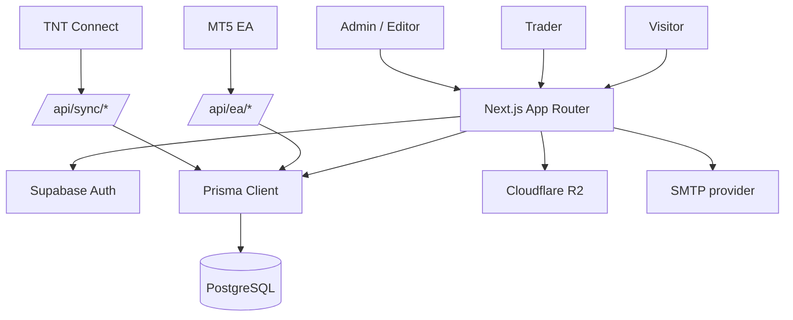

# System

Last reviewed: 2026-05-31

TheNextTrade is a trader operating system: account sync, journal, analytics, Academy, Edge missions, Partner Pro/VIP operations, and admin reporting in one Next.js app. For route-level behavior specs, use [FEATURE_SPECS.md](FEATURE_SPECS.md).

## Stack

| Layer | Current choice |
| --- | --- |
| App | Next.js App Router, React, TypeScript |
| UI | Tailwind CSS, Radix primitives, Lucide icons |
| Database | PostgreSQL via Prisma |
| Auth | Supabase Auth plus app-owned profile/session/security data |
| Storage | Cloudflare R2 through `src/lib/storage/object-storage.ts` |
| Email | SMTP through `src/lib/services/email.service.ts` |
| Analytics | Internal Postgres analytics plus optional GA4 |
| Deploy | Coolify on VPS behind Cloudflare |

## Data Flow

## Core Data Areas

Source of truth: `prisma/schema.prisma`.

- Auth and user profile: `User`, `Profile`, `UserSession`, `AuditLog`, `SecurityLog`, `BlockedIP`.
- Trading: `TradingAccount`, `JournalEntry`, `SyncHistory`, broker/account sync metadata.
- Product access: Pro/VIP entitlement, EA licenses, downloads, copy trading registration.
- Academy: levels, modules, lessons, quizzes, progress, certificates.
- Gamification: Edge points, missions, achievements, daily check-in.
- Analytics: `PageView`, `AnalyticsEvent`, country/referrer/device/campaign data.
- Content: articles, images, SEO fields, comments, votes, content ops metadata.
- User activation state: first-session wizard, selected sync path, reminder dismissal, first sync celebration. Stored under `User.settings.onboarding.firstSession`.

## Route Groups

Source of truth: `src/app`.

- Public: `/`, `/about`, `/contact`, `/edge`, `/legal/*`, `/articles`, `/academy`, `/brokers`, `/tools`.
- Auth: `/auth/login`, `/auth/register`, callbacks, reset/verify flows.
- User dashboard: `/dashboard`, accounts, journal, analytics, reports, mistakes, intelligence, academy, missions, trading systems, copy trading, settings.
- Admin: `/admin`, users, reports, analytics, articles, article ops, academy, IB, EA, security, release health.
- APIs: `/api/auth/*`, `/api/sync/*`, `/api/ea/*`, `/api/analytics/*`, `/api/admin/*`, `/api/articles/*`, `/api/app/version`.

Navigation source of truth: `src/config/navigation.ts`.

## Code Ownership Map

Use this table when assigning bugs or feature work.

| Area | Main routes | Main code paths | Data/services |
| --- | --- | --- | --- |
| Public pages | `/`, `/about`, `/contact`, `/edge`, `/legal/*` | `src/app/(public)`, public page files under `src/app` | SEO helpers, analytics tracking |
| Articles/CMS | `/articles`, `/admin/articles`, `/admin/articles/ops` | `src/app/articles`, `src/app/admin/articles`, article components | Article models, image storage, SEO checks |
| Auth | `/auth/login`, `/auth/register`, auth callbacks | `src/app/auth`, auth actions, middleware/proxy | Supabase Auth, `User`, `Profile`, sessions, security logs |
| Dashboard shell | `/dashboard/*` | `src/app/dashboard/layout.client.tsx`, `src/components/dashboard`, `src/config/navigation.ts` | Auth session, profile, navigation |
| Main dashboard | `/dashboard` | `src/app/dashboard/page.tsx`, `src/app/dashboard/DashboardClient.tsx` | dashboard stats, chart queries, performance helpers, first-session activation state |
| Account hub | `/dashboard/accounts` | `src/components/trading-accounts`, account APIs | `TradingAccount`, Pro eligibility, sync state |
| EA Sync | account setup, EA APIs | `public/downloads/TheNextTrade_TradeSync.mq5`, `src/app/api/ea` | API key auth, commands, account heartbeat |
| TNT Connect | account setup, app version API | `apps/tnt-connect`, `src/app/api/sync`, `src/app/api/app/version` | sync import, timezone normalization, release manifest |
| Journal | `/dashboard/journal` | journal pages/components/actions | `JournalEntry`, imports, manual trades |
| Reports/analytics | `/dashboard/analytics`, `/dashboard/reports`, `/admin/reports`, `/admin/analytics` | dashboard/admin report pages, `src/lib/analytics.ts`, `src/lib/track.ts` | `PageView`, `AnalyticsEvent`, trade/account/user aggregates |
| Edge missions | `/dashboard/missions` | missions pages/components, gamification helpers | Edge/XP, missions, daily check-in, achievements |
| Academy | `/academy`, `/dashboard/academy`, `/admin/academy` | academy routes/components/actions | levels, modules, lessons, quizzes, progress |
| Trading systems | `/dashboard/trading-systems`, `/admin/ea` | trading system and EA admin pages | downloads, licenses, products |
| Copy trading | `/dashboard/copy-trading` | copy trading route/actions | registration/status records |
| Admin users | `/admin/users` | admin user list/detail components | user/profile/country/session/account data |
| Security | `/admin/security` | security admin pages/APIs | `AuditLog`, `SecurityLog`, `BlockedIP` |
| Email | no single route | `src/lib/services/email.service.ts`, email actions | SMTP provider, templates, send logs later |
| Storage | media and generated files | `src/lib/storage/object-storage.ts` | R2/local storage adapter |

## New-User Activation

The first-session activation flow is the current source of truth for new users after signup/verification.

Primary code paths:

- `src/lib/onboarding/first-session.server.ts`: computes activation step, next action, reminder visibility, and preferred sync path.
- `src/actions/first-session-onboarding.ts`: saves sync preference, dismisses reminders, completes wizard, and celebrates first sync.
- `src/components/onboarding/FirstSessionWizard.tsx`: compact setup modal.
- `src/components/onboarding/FirstSessionLauncher.tsx`: dashboard setup launcher.
- `src/components/onboarding/FirstDataReminderBanner.tsx`: 24h no-first-data reminder.
- `src/components/onboarding/SetupProgressTrail.tsx`: visual trail for `Account -> Sync -> Data -> Live`.
- `src/lib/trading-data-state.ts`: central helper for `accountCount`, `tradeCount`, `hasTradeData`, and zero-trade UI decisions.

Stored state under `User.settings.onboarding.firstSession`:

| Field | Meaning |
| --- | --- |
| `selectedSyncMethod` | User's chosen setup path: `tnt`, `ea`, or `manual`. |
| `dismissedUntil` | Temporarily hides the full first-session wizard. |
| `firstDataReminderDismissedUntil` | Temporarily hides the 24h "sync/log first trade" reminder. |
| `completedAt` | Marks first-session setup as completed. |
| `firstSyncCelebratedAt` | Prevents the first-sync success message from repeating. |
| `selectedAccountId` | Account chosen during setup, when available. |

Zero-trade rule:

- If the user has no `JournalEntry`, dashboard filters that depend on account/date context should stay hidden.
- This applies to `/dashboard`, `/dashboard/journal`, `/dashboard/sessions`, `/dashboard/analytics`, `/dashboard/intelligence`, and `/dashboard/psychology`.
- Once the user has at least one `JournalEntry`, the relevant filters return on each route.
- Account Hub cards with `totalTrades = 0` use first-data CTAs instead of generic sync actions: TNT/EA accounts show `Sync first trades`; manual users should be guided to log the first trade.

## Common Bug Entry Points

| Symptom | First places to inspect |
| --- | --- |
| Dashboard crashes on date range | dashboard loader, `src/lib/utils.ts`, account timezone values |
| Wrong win rate/trade score | dashboard stats query/calculation, `JournalEntry` filtering, break-even handling |
| TNT Connect import issue | `apps/tnt-connect`, `/api/sync/*`, sync log, timezone normalization |
| EA shows connected but API errors | `/api/ea/*`, EA API key, account mapping, command polling |
| Country shows unknown/wrong | auth/register country detection, `Profile.country`, admin user components |
| Duplicate account/trader rows | account uniqueness query, IB/trader aggregation, `TradingAccount` identity fields |
| Article SEO/image issue | `/admin/articles/ops`, article SEO checker, storage path resolver |
| Email not sent | `src/lib/services/email.service.ts`, SMTP env, relevant action/API |
| Auth form validation issue | auth page/action, Turnstile bypass rules, rate-limit adapter |
| Admin route unauthorized | role check, `Profile.role`, middleware/server auth helper |
| New user sees duplicate/irrelevant dashboard CTAs | `getFirstSessionState()`, `FirstSessionLauncher`, `FirstDataReminderBanner`, `getUserTradingDataState()` |
| New user sees account/date filters before first trade | route server page, `GreetingHeader.hideFilters`, `JournalList.hasTradeData`, `getUserTradingDataState()` |

## API Rules

- User APIs must resolve the authenticated user server-side.
- Admin APIs must require `Profile.role` of `ADMIN` or `EDITOR`.
- Sync APIs must authenticate with account/user API keys.
- Analytics APIs must avoid storing sensitive personal or broker data.
- File/media APIs should go through the object storage abstraction, not hard-coded local paths.

## Trade Sync

The system supports two sync paths:

- EA Sync: `public/downloads/TheNextTrade_TradeSync.mq5` and `/api/ea/*`.
- TNT Connect: `apps/tnt-connect` and `/api/sync/*`.

Both write into trading account, journal, and sync history data. Current TNT Connect release is `1.0.2`, published through `/api/app/version`.

Timezone rule: broker timezones must be validated before writing to the database. Invalid values fall back to `Etc/UTC` so dashboard date ranges cannot crash.

## Analytics

Internal analytics is the product/admin source of truth:

- Page views are captured from middleware/proxy and stored in `PageView`.
- Product actions use `trackEvent()` and are stored in `AnalyticsEvent`.
- Registered user country comes from `Profile.country`.
- Admin reports aggregate users, profiles, accounts, trades, events, pageviews, Pro/VIP state, and IB activity.

GA4 is optional. Only sanitized client events should be sent when analytics env vars are enabled.

## Security

- Route protection lives in middleware and server-side auth helpers.
- Turnstile/rate limit should protect auth forms in production.
- Development-only bypasses must stay development-only.
- Security/admin events should be logged to `AuditLog`, `SecurityLog`, and `BlockedIP`.
- Never send email, full name, Telegram, MT5 account number, broker account number, raw P/L details, Supabase user ID, or secrets to GA4.
