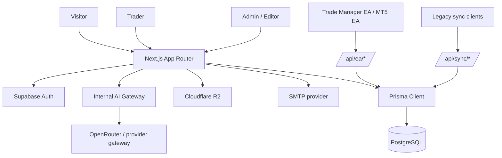

# System

Last reviewed: 2026-08-18

TheNextTrade is a trader operating system: Trade Manager EA/manual trade capture, journal, analytics, Academy, Edge missions, Partner Pro/VIP operations, AI Gateway, trading-system access, and admin reporting in one Next.js app. For route-level behavior specs, use [FEATURE_SPECS.md](FEATURE_SPECS.md).

## Stack

| Layer | Current choice |
| --- | --- |
| App | Next.js App Router, React, TypeScript |
| UI | Tailwind CSS, Radix primitives, Lucide icons |
| Database | PostgreSQL via Prisma |
| Auth | Supabase Auth plus app-owned profile/session/security data |
| Storage | Cloudflare R2 through `src/lib/storage/object-storage.ts` |
| Email | SMTP through `src/lib/services/email.service.ts` |
| Analytics | Internal Postgres analytics plus optional GA4 |
| Deploy | Coolify on VPS behind Cloudflare |

## Data Flow

## Core Data Areas

Source of truth: `prisma/schema.prisma`.

- Auth and user profile: `User`, `Profile`, `UserSession`, `AuditLog`, `SecurityLog`, `BlockedIP`.
- Trading: `TradingAccount`, `JournalEntry`, `SyncHistory`, `TradePlan`, `TradingRule`, `TradeRuleCheck`, `TraderGoal`, broker/account sync metadata.
- Growth & Improvement Loop: `TraderInsightSnapshot` (`trader_insight_snapshots`), `ImprovementExperiment` (`improvement_experiments`), `CoachActionPlan`, `CoachActionPlanItem`.
- Product access: Pro/VIP entitlement, trading-system licenses/downloads.
- Academy: levels, modules, lessons, quizzes, progress, certificates.
- Gamification: Edge points, missions, achievements, daily check-in.
- Analytics: `PageView`, `AnalyticsEvent`, country/referrer/device/campaign data.
- Content: articles, images, SEO fields, comments, votes, content ops metadata.
- User activation state: first-session wizard, selected sync path, reminder dismissal, first sync celebration. Stored under `User.settings.onboarding.firstSession`.

## Route Groups

Source of truth: `src/app`.

- Public: `/`, `/about`, `/contact`, `/edge`, `/legal/*`, `/articles`, `/academy`, `/brokers`, `/tools`.
- Auth: `/auth/login`, `/auth/register`, callbacks, reset/verify flows.
- User dashboard: `/dashboard`, accounts, journal, rules, analytics, reports, mistakes, intelligence, academy, missions, trading systems, settings.
- Admin: `/admin`, users, reports, analytics, articles, article ops, academy, IB, AI Gateway, trading systems, email lab, security, release health.
- APIs: `/api/auth/*`, `/api/sync/*`, `/api/ea/*`, `/api/analytics/*`, `/api/admin/*`, `/api/articles/*`, `/api/app/version`, `/api/trade-plans`, `/api/sync/health`.

Navigation source of truth: `src/config/navigation.ts`.

## Code Ownership Map

Use this table when assigning bugs or feature work.

| Area | Main routes | Main code paths | Data/services |
| --- | --- | --- | --- |
| Public pages | `/`, `/about`, `/contact`, `/edge`, `/legal/*` | `src/app/(public)`, public page files under `src/app` | SEO helpers, analytics tracking |
| Articles/CMS | `/articles`, `/admin/articles`, `/admin/articles/ops` | `src/app/articles`, `src/app/admin/articles`, article components | Article models, image storage, SEO checks |
| Auth | `/auth/login`, `/auth/register`, auth callbacks | `src/app/auth`, auth actions, middleware/proxy | Supabase Auth, `User`, `Profile`, sessions, security logs |
| Dashboard shell | `/dashboard/*` | `src/app/dashboard/layout.client.tsx`, `src/components/dashboard`, `src/config/navigation.ts` | Auth session, profile, navigation |
| Main dashboard | `/dashboard` | `src/app/dashboard/page.tsx`, `src/app/dashboard/DashboardClient.tsx` | dashboard stats, chart queries, performance helpers, first-session activation state |
| Account hub | `/dashboard/accounts` | `src/components/trading-accounts`, account APIs | `TradingAccount`, Pro eligibility, sync state |
| Sync Health Center | `/dashboard/accounts?health=sync` | `src/components/trading-accounts/SyncHealthCenter.tsx`, `SyncHealthSummaryCard.tsx`, `SyncHealthAccountRow.tsx`, `SyncRecoveryAction.tsx` | `TradingAccount`, `SyncHistory`, `ImportHistory`, `src/lib/sync-health.ts` |
| Trade Manager EA sync | account setup, EA APIs | `src/app/api/ea`, trading-system download/config surfaces | API key auth, commands, account heartbeat, first-data sync |
| Legacy sync compatibility | old sync APIs/app artifacts | `src/app/api/sync`, `src/app/api/app/version`, legacy app folders if still present | backwards-compatible import handling only; do not promote in new UI |
| Journal | `/dashboard/journal`, `/api/cron/journal-autopilot` | journal pages/components/actions, `src/lib/journal/autopilot.server.ts`, `src/app/api/cron/journal-autopilot/route.ts`, `src/lib/services/journal-autopilot-scheduler.service.ts` | `JournalEntry`, imports, manual trades, `autopilotStatus`, AI gateway journal autopilot (auto-run via instrumentation on server start, dev + self-hosted prod; override interval with `JOURNAL_AUTOPILOT_CRON`, default `*/15 * * * *`) |
| Trade plans | `/dashboard/journal?tab=plans` | `src/components/journal/TradePlanList.tsx`, `TradePlanCard.tsx`, `TradePlanModal.tsx`, `PlanVsActualPanel.tsx`, `src/actions/trade-plans.ts` | `TradePlan`, `JournalEntry`, account/symbol matching |
| Rulebook and goals | `/dashboard/rules` | `src/app/dashboard/rules/page.tsx`, `src/components/rules/*`, `src/actions/rulebook.ts` | `TradingRule`, `TradeRuleCheck`, `TraderGoal` |
| Trading Style Assessment | `/trading-style`, `/dashboard/settings/trading-style`, `/dashboard/settings/profile` | `src/app/trading-style`, `src/components/trading-style/*`, `src/lib/trading-style/*`, `src/actions/trading-style.ts` | `User.settings.tradingStyle`, 8 Archetypes, 6 Dimensions, scoring engine |
| Privacy and public sharing | `/dashboard/settings/profile`, `/trader/[username]`, `/share/[id]`, `/api/og/trader/[username]` | `src/lib/profile/privacy-presets.ts`, profile settings, public profile/share/OG routes | `Profile`, public stats queries, privacy flags, verified archetype badge |
| Reports/analytics | `/dashboard/analytics`, `/dashboard/reports`, `/admin/reports`, `/admin/analytics` | dashboard/admin report pages, `src/lib/analytics.ts`, `src/lib/track.ts` | `PageView`, `AnalyticsEvent`, trade/account/user aggregates |
| Edge missions | `/dashboard/missions` | missions pages/components, gamification helpers | Edge/XP, missions, daily check-in, achievements |
| Academy | `/academy`, `/dashboard/academy`, `/admin/academy`, `/certificate/[id]`, `/certificate/master/[userId]` | academy routes/components/actions, `src/lib/certificates/certificate-share.server.ts`, `src/components/academy/CertificateShareModal.tsx`, `CertificateShareScale.tsx` | levels, modules, lessons, quizzes, progress, certificates, public share-cards |
| Certificate OG images | `/api/og/certificate/[id]`, `/api/og/certificate/master/[userId]` | `src/app/api/og/certificate/[id]/route.tsx`, `src/app/api/og/certificate/master/[userId]/route.tsx` | `next/og` dynamic preview cards for certificate share links |
| Trading systems | `/trading-systems`, `/dashboard/trading-systems`, `/admin/trading-systems` | trading system public, user, and admin pages | downloads, licenses, products |
| Community / GoldScalperNinja | `/community` | `src/app/community/page.tsx`, `src/components/community/*`, `src/config/telegram.ts` | Telegram/community funnel, broker setup guidance |
| AI Gateway | `/admin/ai`, `/dashboard/intelligence` | `src/actions/admin/ai-gateway.ts`, `src/actions/ai-coach.ts`, `src/lib/ai-gateway/*`, `src/components/admin/ai/*` | providers, models, routing, request logs, audit |
| Economic calendar | `/tools/economic-calendar` | `src/app/tools/economic-calendar`, `src/lib/services/economic-calendar.ts` | configured calendar provider data |
| Email Lab | `/admin/email-lab` | `src/app/admin/email-lab`, `src/lib/services/email.service.ts`, `src/lib/emails/*` | SMTP/Mailtrap template testing |
| Admin users | `/admin/users` | admin user list/detail components | user/profile/country/session/account data |
| Security | `/admin/security` | security admin pages/APIs | `AuditLog`, `SecurityLog`, `BlockedIP` |
| Email | no single route | `src/lib/services/email.service.ts`, email actions | SMTP provider, templates, send logs later |
| Storage | media and generated files | `src/lib/storage/object-storage.ts` | R2/local storage adapter |

## New-User Activation

The first-session activation flow is the current source of truth for new users after signup/verification.

Primary code paths:

- `src/lib/onboarding/first-session.server.ts`: computes activation step, next action, reminder visibility, and preferred sync path.
- `src/actions/first-session-onboarding.ts`: saves sync preference, dismisses reminders, completes wizard, and celebrates first sync.
- `src/components/onboarding/FirstSessionWizard.tsx`: compact setup modal.
- `src/components/onboarding/FirstSessionLauncher.tsx`: dashboard setup launcher.
- `src/components/onboarding/FirstDataReminderBanner.tsx`: 24h no-first-data reminder.
- `src/components/onboarding/SetupProgressTrail.tsx`: visual trail for `Account -> Sync -> Data -> Live`.
- `src/lib/trading-data-state.ts`: central helper for `accountCount`, `tradeCount`, `hasTradeData`, and zero-trade UI decisions.

Stored state under `User.settings.onboarding.firstSession`:

| Field | Meaning |
| --- | --- |
| `selectedSyncMethod` | User's chosen setup path. Current user-facing values are `ea` for Trade Manager EA and `manual` for Manual Journal. Legacy `tnt` may exist only for historical data. |
| `dismissedUntil` | Temporarily hides the full first-session wizard. |
| `firstDataReminderDismissedUntil` | Temporarily hides the 24h "sync/log first trade" reminder. |
| `completedAt` | Marks first-session setup as completed. |
| `firstSyncCelebratedAt` | Prevents the first-sync success message from repeating. |
| `selectedAccountId` | Account chosen during setup, when available. |

Zero-trade rule:

- If the user has no `JournalEntry`, dashboard filters that depend on account/date context should stay hidden.
- This applies to `/dashboard`, `/dashboard/journal`, `/dashboard/sessions`, `/dashboard/analytics`, `/dashboard/intelligence`, and `/dashboard/psychology`.
- Once the user has at least one `JournalEntry`, the relevant filters return on each route.
- Account Hub cards with `totalTrades = 0` use first-data CTAs instead of generic sync actions: Trade Manager EA accounts show `Sync first trades`; manual users should be guided to log the first trade.

## Common Bug Entry Points

| Symptom | First places to inspect |
| --- | --- |
| Dashboard crashes on date range | dashboard loader, `src/lib/utils.ts`, account timezone values |
| Wrong win rate/trade score | dashboard stats query/calculation, `JournalEntry` filtering, break-even handling |
| Legacy sync import issue | `/api/sync/*`, sync log, timezone normalization, legacy source mapping |
| Trade Manager EA shows connected but API errors | `/api/ea/*`, EA API key, account mapping, command polling |
| Country shows unknown/wrong | auth/register country detection, `Profile.country`, admin user components |
| Duplicate account/trader rows | account uniqueness query, IB/trader aggregation, `TradingAccount` identity fields |
| Article SEO/image issue | `/admin/articles/ops`, article SEO checker, storage path resolver |
| Email not sent | `src/lib/services/email.service.ts`, SMTP env, relevant action/API |
| Auth form validation issue | auth page/action, Turnstile bypass rules, rate-limit adapter |
| Admin route unauthorized | role check, `Profile.role`, middleware/server auth helper |
| New user sees duplicate/irrelevant dashboard CTAs | `getFirstSessionState()`, `FirstSessionLauncher`, `FirstDataReminderBanner`, `getUserTradingDataState()` |
| New user sees account/date filters before first trade | route server page, `GreetingHeader.hideFilters`, `JournalList.hasTradeData`, `getUserTradingDataState()` |
| Fresh-user onboarding E2E is unreliable | `tests/e2e/traderwaves-fresh-user-regression.spec.ts`, dedicated test fixture, `User.settings.onboarding`, trading-account/journal cleanup |
| Legacy sync source values remain | `scripts/audit-sync-source.ts`, `src/lib/sync/sync-source.ts`, `TradingAccount.syncSource`, `JournalEntry.syncSource` |
| Rules menu missing from sidebar/mobile nav | `src/config/navigation.ts`, `/dashboard/rules` route protection |
| Trade plan matching or Plan vs Actual is wrong | `src/actions/trade-plans.ts`, `/api/trade-plans/*`, `TradePlan.journalEntryId`, `PlanVsActualPanel.tsx` |
| Public share leaks private values | `src/lib/profile/privacy-presets.ts`, `/trader/[username]`, `/share/[id]`, `/api/og/trader/[username]` |

## Release Hardening Watchlist

Completed QA report files should be deleted after verification. Keep only active bug reports in `docs/`.

Current recurring release checks:

- Fresh-user onboarding must be tested with a true fresh-user fixture, not an old user that already has accounts/trades.
- Legacy sync source values should not leak into current UI copy. New UI should say Trade Manager EA or Manual Journal.
- Dashboard and homepage should expose one next action per context, not every feature at once.

## API Rules

- User APIs must resolve the authenticated user server-side.
- Admin APIs must require `Profile.role` of `ADMIN` or `EDITOR`.
- Sync APIs must authenticate with account/user API keys.
- Analytics APIs must avoid storing sensitive personal or broker data.
- File/media APIs should go through the object storage abstraction, not hard-coded local paths.

## Trade Sync

The current user-facing sync paths are:

- Trade Manager EA: `/api/ea/*`.
- Manual Journal: `/dashboard/journal`.

Legacy `/api/sync/*` code may remain for backwards compatibility, but it should not appear as a primary setup path in new product surfaces.

Timezone rule: broker timezones must be validated before writing to the database. Invalid values fall back to `Etc/UTC` so dashboard date ranges cannot crash.

## Analytics

Internal analytics is the product/admin source of truth:

- Page views are captured from middleware/proxy and stored in `PageView`.
- Product actions use `trackEvent()` and are stored in `AnalyticsEvent`.
- Registered user country comes from `Profile.country`.
- Admin reports aggregate users, profiles, accounts, trades, events, pageviews, Pro/VIP state, and IB activity.
- New-user activation reporting should combine `User.emailVerified`, `User.settings.onboarding`, `TradingAccount`, `JournalEntry`, `TradingReport`, `VipRequest`, `ProEntitlement`, `TraderSignal`, `Notification`, and safe `AnalyticsEvent` events.
- First-value tracking should not depend only on page views. It should use durable product state such as first account, first trade data, first insight celebration, and weekly report generation.

GA4 is optional. Only sanitized client events should be sent when analytics env vars are enabled.

## AI Gateway

The app intentionally uses two gateway layers:

1. **Internal AI Gateway**: application-owned layer for model selection, routing rules, request logging, audit logs, admin visibility, quotas, and fallback behavior.
2. **OpenRouter/provider gateway**: external billing/provider layer that lets the app call multiple models without managing separate provider accounts for every model.

Required flow:

`dashboard/intelligence -> server action/API -> internal AI Gateway -> provider adapter -> OpenRouter/model`

Rules:

- User-facing AI features must not call OpenRouter directly.
- Admin request activity must be created inside the internal gateway before/after provider calls.
- `/admin/ai` should be able to show provider configuration, model catalog, routing policy, request explorer, and audit log.
- If OpenRouter shows traffic but `/admin/ai` does not, inspect whether a user-facing action bypassed `src/lib/ai-gateway/*` or `src/actions/admin/ai-gateway.ts` logging.

## Security

- Route protection lives in middleware and server-side auth helpers.
- Turnstile/rate limit should protect auth forms in production.
- Development-only bypasses must stay development-only.
- Security/admin events should be logged to `AuditLog`, `SecurityLog`, and `BlockedIP`.
- Never send email, full name, Telegram, MT5 account number, broker account number, raw P/L details, Supabase user ID, or secrets to GA4.
