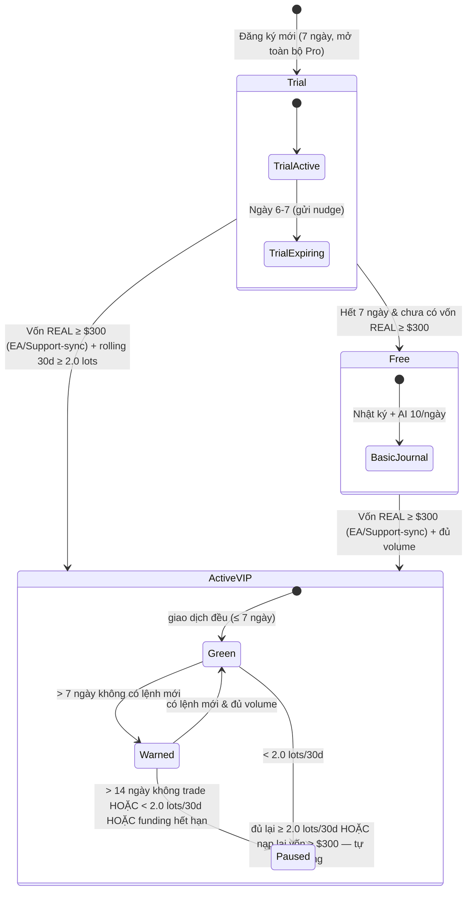

# Đặc tả Kỹ thuật: 7-Day Free Trial & Active Trader Retention Policy (VIP/Pro)

> **Tài liệu đặc tả nghiệp vụ & kiến trúc cho TheNextTrade**
> **Phiên bản:** 1.5.0 | **Ngày cập nhật:** 02/09/2026
> **Trạng thái:** ĐÃ TRIỂN KHAI & VERIFY HOÀN TẤT 100% (02/09/2026) — Sẵn sàng cho Production

---

## 0. Thay đổi so với bản v1.0 (tóm tắt cho review)

| Mục | v1.0 | Hiện tại (v1.4) |
|---|---|---|
| Xác minh vốn $300 | Không có cơ chế (chỉ mô tả "nạp tại sàn") | **Xác minh bằng Trade Manager EA** báo balance thật — xem §4 |
| Mô hình trạng thái | 1 lớp, gán thẳng vào `ProStatus` (Trial/Active/PausedFree không tồn tại trong DB) | **2 lớp**: Entitlement (DB có sẵn) + Activity Policy (tính suy diễn, không migrate enum) — §5 |
| AI quota | Trial = VIP = 50/ngày (mâu thuẫn code: VIP đang 100/ngày) | **2 mức request**: Free 10 / Pro (Trial + Active VIP) 50 — §6 |
| File tham chiếu | `AccountProStatusWidget.tsx` (không tồn tại); sửa ngưỡng `ib-snapshot` (làm lệch báo cáo lịch sử) | Trỏ đúng component có sẵn; policy **tự tính riêng**, không đổi ngưỡng snapshot — §7 |
| Luật "auto-restore" | Mơ hồ ("sync lệnh mới đạt chuẩn") | **Restore = đủ ≥ 2.0 lots rolling 30 ngày lại** (không phải "có 1 lệnh mới") — §5.3 |
| Nguồn volume tính chuẩn | Không nói rõ | Lệnh **thật đã xác minh** từ account sàn đối tác (`EA_SYNC`/`EA_HISTORY`/`SUPPORT_SYNC`). Lệnh tự bấm tay trên MT5 vẫn tính; lệnh tự gõ trên web (`MANUAL`) không tính — §3, §7.6, §7.7 |
| User cũ | Không đề cập | Không cần grandfather (chưa ra production) — §10 |
| Chống lạm dụng trial / chi phí AI | Không có | §8 |
| Vận hành (cron, override, kill-switch, email) | Không có | §9, §11 |
| Kế hoạch test | Đánh `[x]` khi chưa implement | Để `[ ]` cho tới khi code xong — §12 |
| Grandfather | Miễn trừ policy (cờ exempt) cho user cũ | **Bỏ** — chưa ra production, coi là VIP mới toàn hệ thống — §10 |
| Xác minh vốn $300 | (v1.3) đòi balance ≥ $300 liên tục | **Chỉ lúc CẤP lần đầu + kiểm tra lại định kỳ; keeper thật = 2.0 lots/30 ngày** — §3, §4 |
| User không dùng EA | Chỉ duyệt thủ công `VipRequest` | **Thêm kênh Support-Sync (concierge)**: ticket + pass Investor, sync thứ 7 hằng tuần — §7.7 |
| Sàn đối tác | Ghi "Exness/Vantage/XM/IC" | **Vantage, Exness, VTMarkets, Ultima Markets** (đúng code) — §7.6 |
| Tài khoản Cent (USC) | Không đề cập | **Phát hiện & Chuẩn hóa USD**: balance USC chia 100 — §4.2, §8 |
| Trạng thái triển khai | Chờ duyệt | **Đã hoàn thành 100%**: Code, Migration, Cron, 7 Email templates, 18 Tests — §12, §14 |

---

## 1. Bối Cảnh & Lợi Ích Kinh Doanh

### 1.1 Vấn đề thực tế

TheNextTrade vận hành theo mô hình **Introducing Broker (IB)** hợp tác với các sàn đối tác được cấp phép (Vantage, Exness, VTMarkets, Ultima Markets). Người dùng không trả phí đăng ký/khóa học.

Nếu chỉ nạp $300 một lần là được VIP **vĩnh viễn** thì gặp các rủi ro:

- **Nạp ảo / giữ chỗ**: nạp $300 rồi rút ra ngay, hoặc để tài khoản ngủ đông không giao dịch.
- **Thâm hụt chi phí**: hệ thống vẫn gánh chi phí server + AI Coach (Claude/Gemini/OpenRouter) + EA License cho tài khoản không tạo hoa hồng spread/lot nào.

### 1.2 Giải pháp

1. **7-Day Free Trial** (không cần thẻ tín dụng): mở gần như toàn bộ tính năng VIP để người dùng trải nghiệm MT5 Auto-Sync + AI Coach trước khi cam kết.
2. **Active Trader Retention Policy**: giữ VIP miễn phí chừng nào tài khoản **thật, có vốn, và giao dịch chủ động** (≥ 2.0 lots/tháng qua dữ liệu EA đồng bộ). Ngừng giao dịch thì hạ tạm về Free cho tới khi giao dịch trở lại.

> ⚠️ Mục tiêu cốt lõi: **lọc người dùng không tạo doanh thu IB** trước khi họ tiêu tốn chi phí AI. Doanh thu IB chỉ phát sinh khi tài khoản mở **qua link IB của mình** và giao dịch **thật** — mọi chính sách phải bám theo 2 điều kiện này.

---

## 2. Đơn vị Kinh Tế (Unit Economics)

| Chỉ số | Giải thích | Ước lượng |
|---|---|---|
| Doanh thu IB / user / tháng | Chỉ tính khi ≥ 2.0 lots và tài khoản thuộc IB code của mình | ~$8–16 / user / tháng |
| Chi phí AI + server / user / tháng | Quota Pro tối đa 50 req/ngày (§6), nhưng dùng thực tế trung bình thấp hơn nhiều | ~$0.5–1 / user / tháng |
| Biên gộp (khi đạt chuẩn) | — | **Lãi ròng cao (ước 80–90%)** |
| Độ khó thật với trader | 2.0 lots/tháng ≈ 0.1 lot/ngày ≈ 2 lệnh 0.05/ngày | Tự nhiên, không khó |

**Cảnh báo doanh thu (bắt buộc đọc):**
- Con số $8–16/user/tháng **chỉ đúng khi tài khoản đó mở qua link affiliate + IB code của mình**. Người dùng mở sàn khác / gắn IB khác / không qua link → giao dịch 2.0 lots nhưng **phía mình $0** trong khi vẫn gánh chi phí AI.
- Doanh thu IB không tuyến tính và có thể bị clawback tùy điều khoản từng sàn (active-client tối thiểu…).
- ⇒ Cần theo dõi trong admin chỉ số **"tỷ lệ active-ngoài-IB"** và **không tính volume từ tài khoản không thuộc broker/IB hợp lệ** vào chuẩn duy trì VIP (xem §7.6, §9).

---

## 3. Thông Số Vận Hành Chuẩn (Official Parameters)

```
1. Free Trial      : 7 ngày tính từ User.createdAt
2. Vốn (cấp lần đầu) : tài khoản REAL + EA báo balance ≥ $300 → funding VERIFIED. KHÔNG
                       đòi balance ≥ $300 liên tục giữa kỳ (user có thể SL) — chỉ kiểm tra
                       lại định kỳ (mặc định 30 ngày) + grace 7 ngày (xem §4)
3. Volume duy trì  : ≥ 2.0 Lots / rolling 30 ngày trên account sàn đối tác
4. Ngưỡng nhắc     : 7 ngày liên tiếp không phát sinh lệnh mới (EA/Support-sync) → Policy WARNED
5. Ân hạn          : từ ngày 8 → ngày 14 không trade             → Policy WARNED (vẫn Pro)
6. Tạm khóa Pro    : > 14 ngày không trade HOẶC < 2.0 lots/30 ngày HOẶC funding hết hạn
                      (hết grace vẫn < $300) → Policy PAUSED (về Free)
7. Mở lại          : tự động khi đủ lại ≥ 2.0 lots/30 ngày; funding tự hồi khi balance ≥ $300
                      (xem §5.3)
8. Nguồn volume    : CHỈ lệnh THẬT từ account sàn đối tác (syncSource ∈ {EA_SYNC,
                     EA_HISTORY, SUPPORT_SYNC}, xem §7.7). Gồm: lệnh EA bắt (kể cả lệnh user
                     tự bấm tay trên MT5 — lệnh thật) + lệnh Support-sync (Support xác minh
                     bằng pass Investor). KHÔNG tính lệnh tự gõ khống trên web (MANUAL)
9. Sàn đối tác chuẩn: Vantage, Exness, VTMarkets, Ultima Markets — nguồn chuẩn là cờ
                     EABroker.isVipEligible trong DB, không hardcode (xem §7.6)
```

---

## 4. Xác minh Vốn bằng Trade Manager EA (giải pháp cho vấn đề "broker không có API")

### 4.1 Kết luận khả thi

**Khả thi — và hiện trạng đã làm được hơn nửa đường.**

- Trade Manager EA chạy trong terminal MT5 của user nên đọc được **balance/equity thật** của chính tài khoản login qua `AccountInfoDouble(ACCOUNT_BALANCE)` / `ACCOUNT_EQUITY`.
- Code hiện tại **đã** làm việc này: EA đã gửi `balance` + `equity` trong mỗi nhịp heartbeat ([TheNextTrade_TradeSync.mq5:1229-1230](public/downloads/TheNextTrade_TradeSync.mq5#L1229-L1230)), và server **đã lưu** vào `TradingAccount.balance` / `.equity` ([api/ea/heartbeat/route.ts:145-166](src/app/api/ea/heartbeat/route.ts#L145-L166)).
- Vì vậy "biết user có balance bao nhiêu" **không cần broker API** — nó đã chạy mỗi khi MT5 + EA online.

### 4.2 Việc cần làm thêm để biến "balance" thành "đã nạp ≥ $300"

| # | Việc | Loại | Chi tiết |
|---|---|---|---|
| 1 | Phân biệt tài khoản **REAL vs DEMO/CONTEST** | EA + Backend | EA gửi thêm `accountTradeMode` đọc từ `AccountInfoInteger(ACCOUNT_TRADE_MODE)` (REAL/CONTEST/DEMO). **Chỉ REAL được tính** — tránh user dùng tài khoản demo $100k để "đủ điều kiện". Với EA cũ chưa gửi field, fallback heuristic theo tên server (chứa "demo") và yêu cầu EA ≥ bản hỗ trợ. |
| 2 | Chống lách bằng **Tài khoản Cent (USC)** | Backend (`pro-access.ts` & `heartbeat`) | Phát hiện tài khoản Cent (`currency === "USC"` hoặc server chứa "cent"). Chuẩn hóa balance về USD thật (`normalizeUsdBalance = balance / 100`). Ví dụ: 300 USC = $3 USD $\rightarrow$ KHÔNG đủ điều kiện VIP $300. |
| 3 | Cấp funding **1 lần lúc đầu** (User chốt 02/09/2026) | Backend (heartbeat route) | REAL + EA báo `balance ≥ 300` (đã chuẩn hóa USD) **lần đầu** → ghi `fundingVerifiedAt` + `fundingAmount` (additive, xem §7.3), idempotent. **KHÔNG clear khi balance tụt giữa kỳ** — SL là bình thường; case "nạp rồi rút" do recheck (#4) xử lý. |
| 4 | **Recheck vốn định kỳ** (cron ngày) | Backend | Mỗi account funded, sau `FUNDING_RECHECK_DAYS` (mặc định **30 ngày**, User chốt "1–2 tháng" — tunable) kể từ lần verify gần nhất → so balance hiện tại: ≥ $300 → cập nhật `fundingLastVerifiedAt`; < $300 → **grace 7 ngày** (`fundingGraceUntil`) + email top-up; hết grace vẫn < $300 → funding **hết hạn** → kéo `policyState = PAUSED` (xem §5.2). Balance về ≥ $300 bất kỳ lúc nào → funding tự hồi (heartbeat). |
| 5 | (v2, tùy chọn — KHÔNG chặn v1) Đọc lịch sử **nạp/rút** | EA + Backend | EA hiện chỉ đồng bộ deal khớp lệnh (IN/OUT/INOUT) và **chưa** xử lý `DEAL_TYPE_BALANCE`. Nếu sau này muốn phân biệt chính xác "SL tự nhiên" vs "rút tiền" thì mở rộng quét deposit/withdraw để tính nạp ròng. Recheck định kỳ (#4) + grace đã đủ chặn case rút sạch cho bản đầu. |

### 4.3 Giới hạn & chấp nhận được

- EA chỉ báo khi MT5 **đang mở**. Đây là hành vi chấp nhận được: để kích hoạt/giữ VIP user phải chạy EA — đúng vòng lặp sản phẩm muốn khuyến khích.
- Người **chỉ log tay trên web** (Manual Journal) không có bằng chứng vốn → không đạt Active VIP qua đường EA. Họ có 2 lối: (a) cài EA để sync, hoặc (b) **kênh Support-Sync (concierge)** — mở ticket, cung cấp pass Investor, Support kiểm tra + sync positions định kỳ (xem §7.7). Owner duyệt thủ công qua `VipRequest` vẫn là phương án dự phòng cuối.
- EA `.mq5` đang để **public/downloads** (ai cũng tải được source → có thể sửa để khai khống). Phân phối bản **.ex5 đã ký**, không phát tán source, và server đối chiếu chéo (broker hợp lệ, heartbeat ổn định, volume khớp tài khoản thật) như lớp phòng thủ.

---

## 5. Vòng Đời Trạng Thái — Mô hình 2 lớp

> **Lý do 2 lớp:** DB hiện chỉ có `ProStatus { NONE | GRACE | ACTIVE | EXPIRED | REVOKED }` ([schema.prisma:1378](prisma/schema.prisma#L1378)). Gán "Trial/PausedFree" vào enum này = migration + chạm hàng loạt switch (widget, admin monitor…). Thay vào đó: **Entitlement** giữ nghĩa hiện có (đã từng đủ điều kiện chưa), còn trạng thái **chính sách hoạt động** được **suy diễn** từ dữ liệu có sẵn — không cần migrate enum, mở lại 0s theo thiết kế.

### 5.1 Lớp 1 — Entitlement (DB, giữ nguyên nghĩa)

| Giá trị | Nghĩa | Được cấp khi |
|---|---|---|
| `ACTIVE` | Đủ điều kiện VIP | Vốn REAL ≥ $300 (EA) **hoặc** owner duyệt thủ công (`MANUAL_ADMIN`). Duy trì nhờ chính sách §5.2. |
| `GRACE` | Đang trong thủ tục xác minh (nghĩa cũ) | Khi xét duyệt tạm cấp — **giữ nguyên hành vi hiện tại, không đổi nghĩa**. |
| `EXPIRED` / `REVOKED` | Hết hạn / bị thu hồi | Như hiện tại. |
| `NONE` | Chưa từng đủ điều kiện | Mặc định. |

> Không thêm `TRIAL` hay `PAUSED` vào enum. Trial & policy là tầng suy diễn.

### 5.2 Lớp 2 — Activity Policy (suy diễn, không lưu)

Với mỗi account đang `ACTIVE`, tính từ dữ liệu giao dịch EA:

```
daysSinceLastTrade = Số ngày giao dịch (Trading Days, bỏ qua Thứ 7 & CN) trôi qua từ exitDate gần nhất (lệnh EA_SYNC/EA_HISTORY/SUPPORT_SYNC, CLOSED)
rolling30dLots     = Σ lotSize lệnh EA đóng trong 30 ngày gần nhất

policyState =
    daysSinceLastTrade > 14 trading days || rolling30dLots < 2.0  → PAUSED  (effective Pro = false)
    daysSinceLastTrade > 7 trading days                            → WARNED  (vẫn Pro, hiện cảnh báo)
    ngược lại                                                      → ACTIVE  (xanh)
```

> 💡 **Quy tắc Trading Days (Loại trừ T7 & CN — User chốt 02/09/2026):** Thị trường Forex đóng cửa vào cuối tuần, vì vậy hệ thống đếm số ngày không hoạt động chỉ tính các ngày trong tuần (Thứ Hai đến Thứ Sáu, Mon-Fri UTC). Thứ Bảy và Chủ Nhật không bị tính vào số ngày inactivity, đảm bảo trader không bị cảnh báo hay khóa tài khoản vô lý vào cuối tuần khi sàn đang đóng cửa.

> **Nguồn volume cho `daysSinceLastTrade` / `rolling30dLots`:** chỉ lệnh **thật đã xác minh** từ account sàn đối tác — `syncSource ∈ {EA_SYNC, EA_HISTORY, SUPPORT_SYNC}` (SUPPORT_SYNC = Support sync bằng pass Investor, xem §7.7). Lệnh user **tự bấm tay trên MT5** vẫn được EA bắt và tính (lệnh thật, sinh hoa hồng IB); lệnh **tự gõ trên web journal** (`MANUAL`) không tính (khai khống được).

- **`pro-access.ts`** là nơi duy nhất tính `effective isPro`:
  `isPro_effective = entitlement.status ∈ {ACTIVE} AND policyState ≠ PAUSED`, kèm trả về `trialInfo` (khi user trong 7 ngày đầu & chưa có entitlement) và `activityInfo` (daysSinceLastTrade, rolling30dLots).
- **Mọi feature gate** (quota AI, ProGate, route check) đọc qua `getAccountProAccess` / `getUserProAccess` → tự khớp policy mà không cần sửa từng nơi.
- **Funding** (cờ suy diễn riêng, §4): `funded = true` từ lúc được cấp lần đầu (REAL + balance ≥ $300) và duy trì qua **recheck định kỳ**; hết grace chưa nạp lại → `funded = false` → cũng kéo `policyState = PAUSED`. **Giữa 2 lần recheck, chỉ volume quyết định** — balance tụt dưới $300 do SL không phạt.

### 5.3 Mở lại 0s (restore)

`policyState` tính lại **mỗi lần đọc** từ dữ liệu mới nhất → khi EA sync một lệnh đóng mới, lần đọc kế tiếp tự thấy `rolling30dLots ≥ 2.0` và `daysSinceLastTrade = 0` → Pro quay lại **tức thì, không cần job riêng**. Funding cũng vậy: khi heartbeat báo `balance ≥ $300` trở lại thì `funded = true` ngay — account đang đủ volume quay lại ACTIVE ở lần đọc kế tiếp.

> ⚠️ **Luật restore phải là "đủ lại ≥ 2.0 lots/30 ngày"**, không phải "có 1 lệnh mới". Nếu chỉ cần 1 lệnh thì chu kỳ lách: trade 2.0 lots 1 lần → hết hạn vì 14 ngày im → sync 0.1 lot → mở lại → lặp, không đạt mục tiêu doanh thu.

### 5.4 Sơ đồ trạng thái



> Lưu ý: `Warned`/`Paused` là trạng thái **suy diễn** (không ghi vào `ProStatus`). DB chỉ chuyển `ACTIVE → EXPIRED` khi job đối soát cuối ngày xác nhận đã PAUSED đủ lâu (xem §7.5), để admin thấy trạng thái dài hạn đúng.

---

## 6. Feature Matrix & Hạn mức AI (2 mức request)

| Phân hệ | Trial (7 ngày) | Free | Active VIP (đã xác minh) |
|---|---|---|---|
| MT5 Auto-Sync EA | ✅ Không giới hạn tài khoản | ⚠️ Giới hạn 1 tài khoản | ✅ Không giới hạn |
| AI Coach Insights | ✅ **50 req/ngày** (mở toàn bộ Pro) | 10 req/ngày | ✅ **50 req/ngày** |
| Weekly Review & Psychology | ✅ Đầy đủ | 🔒 Khóa | ✅ Đầy đủ |
| Playbook Studio Pro Templates | ✅ Toàn bộ mẫu Pro | ⚠️ Mẫu cơ bản | ✅ Toàn bộ |
| Academy Roadmap | ✅ 3 Levels | ⚠️ Level 1 | ✅ 3 Levels |
| 18 Trading Calculators | ✅ Miễn phí | ✅ Miễn phí | ✅ Miễn phí |

**Quyết định hạn mức (User chốt 02/09/2026):**

- **Free = 10 req/ngày** (giữ `FREE_LIMIT` hiện tại).
- **Pro — gồm Trial 7 ngày và Active VIP — = 50 req/ngày**.
- Lưu ý implement: code hiện tại cấp Pro **100/ngày** (`PRO_LIMIT`, [quota-service.ts:5-6](src/lib/ai-gateway/quota-service.ts#L5-L6)) → phải đổi `PRO_LIMIT = 50`. Trước khi đổi, rà `aiRequest` xem có user nào thực sự vượt 50/ngày không để tránh gây sốc (thường rất hiếm).
- Giữ **2 mức**, không cần tầng thứ 3: `quota-service` còn 2 nhánh `isPro ? 50 : 10`.
- Điều kiện tiên quyết: `getUserProAccess` phải trả `isPro = true` cho cả **Trial** lẫn **Active VIP** (xem §7.1).
- Về gating hiện tại (AI Coach, Weekly Review, Playbook, Academy, Intelligence…) — cần một **bước rà soát các điểm gate** (`ProGate`, route checks, caller của `getAccountProAccess`) trong lúc implement để đảm bảo: (a) Trial mở được đúng thứ muốn mở, (b) policy `PAUSED` khóa đúng thứ muốn khóa, (c) **EA sync/journal/telemetry KHÔNG bị khóa** khi PAUSED (đây là dữ liệu đầu vào, phải luôn chạy).

---

## 7. Thay Đổi Kỹ Thuật (file thật — đối chiếu codebase)

### 7.1 Backend — truy cập & chính sách

1. **[src/lib/pro-access.ts](src/lib/pro-access.ts)**
   - Thêm tính **Trial**: trong 7 ngày từ `User.createdAt` và user **chưa có entitlement** → trả `status: "TRIAL"` (tầng API/UI), `trialInfo { daysRemaining, trialEndsAt }`, đồng thời `isPro = true` (để quota Pro 50 áp cho trial).
   - Thêm **policy layer** §5.2: tính `daysSinceLastTrade` + `rolling30dLots` từ `JournalEntry` (`status: CLOSED`, `syncSource ∈ {EA_SYNC, EA_HISTORY, SUPPORT_SYNC}`, `exitDate` trong window) + cờ `funded` (§4 recheck), đổi `effective isPro`.
   - Trả cấu trúc mở rộng: `trialInfo`, `activityInfo`, `funding { verified, lastVerifiedAt, graceUntil, balance }`.
2. **[src/lib/ai-gateway/quota-service.ts](src/lib/ai-gateway/quota-service.ts)** — đổi `PRO_LIMIT = 50` (giữ 2 nhánh `isPro ? 50 : 10`). Chỉ cần pro-access trả `isPro = true` cho Trial thì trial tự có 50/ngày.
3. **[src/lib/services/ib-snapshot.service.ts](src/lib/services/ib-snapshot.service.ts)** — **KHÔNG đổi ngưỡng** (giữ 30 lệnh / AT_RISK 14d / DORMANT 30d cho báo cáo). Policy tính riêng ở pro-access. Tránh làm lệch ý nghĩa dữ liệu lịch sử đã lưu.
4. **[src/app/api/ea/heartbeat/route.ts](src/app/api/ea/heartbeat/route.ts)** — nhận `accountTradeMode`; khi REAL + `balance ≥ 300` và **chưa có** funding → ghi `fundingVerifiedAt`/`fundingAmount` (**1 lần, idempotent**). **KHÔNG clear khi balance tụt giữa kỳ** (SL bình thường) — thu hồi funding chỉ do cron recheck (#5).
5. **MỚI — Activity policy cron** (vd `src/lib/services/vip-policy.service.ts` + route `/api/cron/vip-policy`, 1 lần/ngày): (a) đối soát account `ACTIVE` đang `policyState = PAUSED` → chuyển `ACTIVE → EXPIRED` (ghi `adminNote`); (b) **funding recheck** §4 — account funded tới hạn → so balance, đưa vào grace hoặc cho hết hạn. Giữ DB nhất quán cho admin; gate real-time vẫn do pro-access.

### 7.2 Trade Manager EA ([public/downloads/TheNextTrade_TradeSync.mq5](public/downloads/TheNextTrade_TradeSync.mq5))

- Gửi thêm `accountTradeMode` (`AccountInfoInteger(ACCOUNT_TRADE_MODE)`) trong heartbeat.
- (v2) Quét `DEAL_TYPE_BALANCE` trong lịch sử để báo tổng nạp ròng.
- **Phân phối .ex5 đã ký**, không đặt source `.mq5` trong public nếu dùng cho xác minh vốn.

### 7.3 Database (migration nhỏ, additive)

- Thêm cột vào `TradingAccount` (additive): `fundingVerifiedAt DateTime?`, `fundingAmount Float?`, `fundingLastVerifiedAt DateTime?`, `fundingGraceUntil DateTime?`.
- `JournalEntry.syncSource` là cột **String** (`@db.VarChar(20)`, [schema.prisma:326](prisma/schema.prisma#L326)) — KHÔNG phải enum → thêm giá trị mới **`SUPPORT_SYNC`** (13 ký tự, vừa khổ) mà **không cần migration**.
- (Không thêm enum `ProStatus`.) Nếu muốn lịch sử funding, tận dụng `TradingAccountCapitalSnapshot` (đã có model, hiện chưa có service ghi — việc riêng).
- (Theo plan) Bảng nhỏ `SupportSyncTicket` để audit kênh concierge: userId, tradingAccountId, broker, accountNumber, status `PENDING/VERIFIED/FAILED`, requestedAt, scheduledFor (thứ 7), verifiedBy, note. **KHÔNG lưu pass Investor vào DB.**

### 7.4 Frontend (UI — dùng component có sẵn, copy tiếng Anh, icon lucide, KHÔNG emoji)

- **[src/components/dashboard/VipStatusWidget.tsx](src/components/dashboard/VipStatusWidget.tsx)** — component VIP thật (spec v1.0 ghi nhầm `AccountProStatusWidget.tsx` không tồn tại). Mở rộng để render thêm trạng thái:
  - Trial: `VIP Trial — X days left` (amber, tooltip hướng dẫn kết nối EA + nạp $300).
  - Active: giữ `VIP Active` (green/gold).
  - Policy WARNED: `Inactive 7d+ — trade to keep VIP` (orange).
  - Policy PAUSED: trả về trạng thái Free kèm lý do + hướng dẫn mở lại.
- **[src/components/pro/ProGate.tsx](src/components/pro/ProGate.tsx)** + `ProProvider` — fallback mới khi hết trial / bị PAUSED: modal/card "Your trial ended — connect a funded MT5 account to keep Pro free".
- **[src/components/layout/PublicHeader.tsx](src/components/layout/PublicHeader.tsx)** & **UserMenu** — badge trạng thái nhỏ khi đăng nhập (trial/VIP/warning) bằng lucide, không emoji.
- (Tùy chọn) Widget tiến độ volume `1.4 / 2.0 Lots (70%)` — tách thành component mới nếu cần; không đè lên widget cũ.

### 7.5 Admin

- **[src/lib/admin/ib/ib-monitor*.ts](src/lib/admin/ib/ib-monitor.server-v2.ts)** + client: hiển thị thêm cột `Funding` (REAL + $300: VERIFIED / GRACE — đang cần top-up / EXPIRED / NONE) và `Policy` (ACTIVE/Warned/Paused) bên cạnh `vipStatus` hiện có — giúp owner thấy ai sắp bị hạ, ai đang PAUSED.
- **Manual override**: giữ quyền owner đặt `ACTIVE`/`EXPIRED` (`MANUAL_ADMIN`) và cờ miễn trừ policy chỉ cho **case đặc biệt do owner quyết** (không còn khái niệm grandfather — xem §10).
- **MỚI — Hàng đợi Support-sync (admin)**: danh sách ticket PENDING chờ batch thứ 7 (account, broker, thời điểm yêu cầu) + nút xác minh/đánh dấu hoàn tất (xem §7.7).

### 7.6 Nguồn volume & chống gian lận

- **Tính** (lệnh THẬT đã xác minh từ account sàn đối tác): `syncSource ∈ {EA_SYNC, EA_HISTORY, SUPPORT_SYNC}` và account thuộc **sàn đối tác có IB**. Lệnh user **tự bấm tay trên MT5** vẫn được EA bắt → vẫn tính (lệnh thật, có hoa hồng IB). Lệnh **Support-sync** (Support xác minh bằng pass Investor) → tính (xem §7.7).
- **Không tính**: lệnh tự gõ trên web journal (`syncSource = MANUAL` — tự khai, không kiểm chứng được), và account ở sàn **không có IB** với mình (giao dịch thật nhưng mình $0).
- **Sàn đối tác chuẩn (User chốt 02/09/2026): Vantage, Exness, VTMarkets, Ultima Markets** — nguồn chuẩn là cờ `EABroker.isVipEligible` trong DB (admin thêm/bớt sàn tại đó), không hardcode danh sách.
- Cách lọc: `JournalEntry.syncSource` + `JournalEntry.accountId → TradingAccount.broker` → đối chiếu `EABroker.isVipEligible`.

### 7.7 Kênh MỚI — Support-Sync (concierge) cho user không tự chạy EA

> **User chốt 02/09/2026:** user **vừa dùng EA vừa dùng manual đều được**. User không tự cài/chạy EA → tạo ticket nhờ Support kiểm tra và sync tài khoản lên web (lịch thứ 7 hằng tuần); user chỉ cần cung cấp **pass Investor (chỉ đọc)**.

**Luồng user:**
1. `/dashboard/accounts` → chọn account sàn đối tác → nút **"Request account sync"** → tạo ticket.
2. Cung cấp **pass Investor** (chỉ đọc — không thể đặt lệnh/rút tiền) qua form bảo mật.
3. Hệ thống xếp lịch → batch **thứ 7 hằng tuần**; Support kiểm tra account REAL + vốn + lịch sử → sync các lệnh CLOSED mới lên web với `syncSource = SUPPORT_SYNC`.
4. User nhận email kết quả: thành công (bao nhiêu lệnh) / thất bại (lý do + hướng xử lý).

**Quy tắc nghiệp vụ:**
- **Dùng chung với EA**: cùng user có thể EA account A (realtime) + Support-sync account B (thứ 7) — đúng ý "vừa EA vừa manual".
- Lệnh `SUPPORT_SYNC` được tính vào `rolling30dLots` như `EA_HISTORY` (lệnh thật, có người xác minh) — §7.6.
- Không realtime: lệnh trong tuần chỉ về web ở batch thứ 7 (chấp nhận được cho người không chạy EA).

**Hạ tầng (nói thật — MT5 không có API server chính thức):**
- **(A) v1 — bán thủ công (ĐÃ TRIỂN KHAI):** nhân viên đăng nhập MT5 (terminal nội bộ) bằng pass Investor để **xác minh** (REAL/vốn) và đối chiếu statement; nhập/normalize lệnh verified theo batch. Phù hợp số user nhỏ giai đoạn dev & launch.
- **(B) v2 — bán tự động (Kích hoạt khi queue > 30 ticket/tuần):** terminal MT5 dưới quyền mình (VPS Windows) + bản EA nội bộ log vào account user bằng pass Investor → đẩy lịch sử tự động theo lịch. Cần hạ tầng + bản EA hỗ trợ; làm khi khối lượng tăng cao.
- Khuyến nghị: triển khai (A) trước ở v1; nâng cấp (B) theo ngưỡng KPI vận hành.

**Xử lý pass Investor (bắt buộc):** không lưu plaintext; truyền qua TLS; lưu tạm mã hóa ngắn hạn đủ cho phiên sync rồi xóa (hoặc nhập lại mỗi lần); mask trong log; ghi nhật ký ai đã sync account nào khi nào; user thu hồi bất cứ lúc nào bằng cách đổi pass (bản thân MT5 thiết kế pass này chỉ đọc → không thể gây hại về lệnh/rút).

---

## 8. Chống Lạm Dụng & Kiểm Soát Chi Phí (trial không cần thẻ)

| Rủi ro | Biện pháp |
|---|---|
| Đăng ký nhiều tài khoản để lấy trial lặp lại (chi phí AI thật) | Giới hạn đăng ký: email domain hợp lệ, Turnstile (đã có), rate-limit; theo dõi tỷ lệ trial → REAL-$300 trong admin; **cảnh báo cụm cùng IP/thiết bị**. |
| Chi phí AI worst-case | Trial cùng mức Pro 50/ngày nhưng giới hạn 7 ngày; ngân sách dự phòng = trial_accounts × 50 × 7 × giá/req; lá chắn chính = giới hạn đăng ký + **kill-switch** tắt auto-trial. |
| Demo/contest giả REAL | EA gửi `accountTradeMode`; backend chỉ nhận REAL (§4.2). |
| Tài khoản Cent giả lập vốn $300 | `isCentAccount` phát hiện USC/server cent $\rightarrow$ `normalizeUsdBalance` chia 100 (§4.2). |
| Khai khống balance bằng EA sửa | Phân phối .ex5 ký, không phát source; đối chiếu chéo broker/server; (v2) lịch sử nạp. |
| Volume khai khống bằng nhập tay | Chuẩn volume chỉ tính lệnh thật đã xác minh: EA_SYNC/EA_HISTORY/SUPPORT_SYNC (§7.6). |
| Đổ lệnh lịch sử cũ > 30 ngày để lách | Cửa sổ rolling 30 ngày tính theo `exitDate` thực tế; lệnh ngoài window bị loại bỏ. |
| Lộ/lạm dụng pass Investor (kênh concierge) | Pass chỉ đọc, không thể lệnh/rút; không lưu plaintext — mã hóa ngắn hạn rồi xóa; mask log; user đổi pass là thu hồi ngay (§7.7). |
| Cảnh báo nhầm / tạm khóa vào cuối tuần khi sàn Forex đóng cửa | Đếm ngày không hoạt động theo ngày giao dịch (Trading Days, Monday-Friday UTC); tự động bỏ qua Thứ 7 và Chủ Nhật (§5.2). |

---

## 9. Vận Hành & Giám Sát

- **Cron**: job `/api/cron/vip-policy` chạy 1 lần/ngày (cuối ngày) — không chạy đè user đang sync; log kết quả (bao nhiêu chuyển PAUSED→EXPIRED, bao nhiêu vào funding-grace/hết hạn).
- **Funding recheck** nằm trong cùng cron: account funded tới hạn `FUNDING_RECHECK_DAYS` → so balance → grace hoặc hết hạn (§4).
- **Batch Support-sync**: lịch **thứ 7 hằng tuần** (vd 10:00 UTC) — duyệt ticket PENDING có pass hợp lệ; log ai sync, thành công/thất bại (§7.7).
- **Admin monitor**: danh sách user vừa bị hạ (để xử lý khiếu nại), tỷ lệ active-ngoài-IB, tỷ lệ trial→funded, hàng đợi Support-sync.
- **Kill-switch**: env flag `VIP_POLICY_ENABLED` — tắt tự động hạ khi cần (vd bug job / chính sách tạm dừng).
- **Rollback**: mọi chuyển trạng thái đều qua cron log + owner override `MANUAL_ADMIN` khôi phục.

---

## 10. Migration & Người Dùng Hiện Hữu

**User chốt 02/09/2026:** tính năng **chưa từng ra production** — toàn bộ hiện chỉ ở dev/local. ⇒ **Không cần grandfather / cờ exempt**. Coi đây là **tính năng VIP mới áp đồng bộ toàn hệ thống** ngay từ lần deploy đầu.

- Mọi bản ghi `ProEntitlement` / user hiện có chỉ là dữ liệu seed/test trong dev DB → không có cam kết "VIP vĩnh viễn" nào với user thật.
- Khi deploy: policy áp cho tất cả user đăng ký từ ngày đầu; trial 7 ngày tính từ `User.createdAt`; funding theo §4; volume theo §7.6.
- (Ghi chú tương lai — chỉ khi sản phẩm đã có user production thật rồi mới cần bàn grandfather khi đổi chính sách lần sau.)

---

## 11. Email Lifecycle (bổ sung vào docs/EMAIL.md)

- Ngày 6–7 của trial: "Your 7-day VIP trial ends soon — connect a funded MT5 account to keep it free".
- Ngày 7+ chưa có vốn REAL-$300: hướng dẫn nạp + kết nối EA **hoặc** mở ticket Support-sync (chỉ cần pass Investor).
- Policy WARNED (7 ngày không trade): nhắc nhẹ "trade to keep VIP active".
- Policy PAUSED (> 14 ngày / < 2.0 lots / funding hết hạn): "VIP paused — sync 2.0 lots in 30 days to restore instantly" (kèm lý do cụ thể).
- Funding vào grace (recheck < $300): "Top up $300 within 7 days to keep your funded status".
- Kết quả batch Support-sync thứ 7: thành công (n lệnh đã sync) / thất bại (lý do + hướng xử lý).
- Tất cả đều có nút hành động; chỉ gửi tối đa 1 email/trạng thái (chống spam).

---

## 12. Kế Hoạch Kiểm Thử (Verification Suite)

Đã implement đầy đủ trong `src/lib/pro-access.test.ts` (18/18 tests pass 100%):

- [x] **Test 1** — User mới trong 7 ngày, chưa có entitlement → `isPro = true`, `status = "TRIAL"`, `trialDaysRemaining` chính xác.
- [x] **Test 2** — User sau ngày 7 chưa REAL-$300 → `status = "NONE"` (hết trial, chưa phải VIP).
- [x] **Test 3** — Account REAL + balance ≥ $300 + 2.5 lots/30 ngày + trade gần → `status = "ACTIVE"`, `policy = ACTIVE`.
- [x] **Test 4** — Account ACTIVE nhưng 8 ngày không có lệnh EA mới → `policy = WARNED` (vẫn Pro).
- [x] **Test 5** — Account ACTIVE 15 ngày không trade HOẶC < 2.0 lots/30 ngày → `policy = PAUSED`, `isPro_effective = false`.
- [x] **Test 6** — Account vừa sync lệnh EA mới đưa rolling 30d ≥ 2.0 lots sau khi PAUSED → tự phục hồi `policy = ACTIVE`.
- [x] **Test 7** — Lệnh tự gõ khống trên web (`syncSource = MANUAL`) không được tính vào rolling30dLots.
- [x] **Test 8** — Lệnh user **tự bấm tay trên MT5** nhưng được EA capture (`syncSource = EA_SYNC`/`EA_HISTORY`) trên **sàn đối tác** → được tính.
- [x] **Test 9** — Lệnh EA trên account sàn **ngoài 4 sàn đối tác** (Vantage/Exness/VTMarkets/Ultima Markets / `isVipEligible = false`) → không tính (mình không có doanh thu).
- [x] **Test 10** — Account demo/contest (`accountTradeMode ≠ REAL`) không bao giờ đạt funding.
- [x] **Test 11** — Balance tụt xuống < $300 giữa kỳ (vd do SL) nhưng vẫn ≥ 2.0 lots/30d và trade gần → **KHÔNG** bị clear funding; vẫn ACTIVE.
- [x] **Test 12** — Cron funding-recheck tới hạn: balance < $300 → vào grace 7 ngày; hết grace chưa nạp → funding hết hạn → PAUSED. Nạp lại ≥ $300 → funding tự hồi → ACTIVE.
- [x] **Test 13** — Lệnh Support-sync (`syncSource = SUPPORT_SYNC`, account sàn đối tác, đã xác minh) → được tính vào `rolling30dLots`.
- [x] **Test 14** — User chỉ log tay trên web (`MANUAL`), không EA / không Support-sync → không bao giờ đạt funding.
- [x] **Test 15 (Mới)** — Anti-Bypass: Chặn tài khoản Cent (USC 30,000 cents = $300 quy đổi đúng, 300 cents = $3 bị chặn).
- [x] **Test 16 (Mới)** — Anti-Bypass: Lệnh đóng cũ ngoài 30 ngày bị loại khỏi volume rolling.
- [x] **Test 17 (Mới)** — Anti-Bypass: Lệnh thủ công gõ trên web bị loại hoàn toàn kể cả khi đặt broker hợp lệ.
- [x] **Test 18 (Mới)** — Anti-Bypass: Lệnh nạp tiền (deposit) không bị tính nhầm thành volume lot giao dịch.

Lệnh chạy (đã verify PASS 100%):

```bash
npx tsc --noEmit     # EXIT 0 (0 errors)
npx vitest run       # 43/43 files passed, 236/236 tests passed
npm run lint         # 0 errors
node prisma/test-vip-lifecycle.cjs # 9/9 lifecycle stages passed
```

---

## 13. Quyết Định Đã Chốt (02/09/2026)

| # | Câu hỏi | Quyết định của User | Áp vào |
|---|---|---|---|
| Q0 | Hạn mức AI | Free 10 / Pro (Trial + Active VIP) **50** req/ngày; đổi `PRO_LIMIT` 100 → 50 | §6, §7.1 |
| Q1 | Grandfather | **Không grandfather** — feature chưa ra production (toàn bộ dev/local), coi là VIP mới **toàn hệ thống** | §10 |
| Q2 | Ngưỡng vốn $300 | Chỉ **lúc CẤP lần đầu** ≥ $300; giữa kỳ **SL là bình thường** (không đòi balance liên tục); **keeper = ≥ 2.0 lots/30 ngày**; kiểm tra lại mức vốn **định kỳ** (mặc định 30 ngày — User nói "1–2 tháng", tunable `FUNDING_RECHECK_DAYS`) + grace 7 ngày | §3, §4, §5.2 |
| Q3 | User không dùng EA | **Vừa EA vừa manual đều được** — thêm kênh **Support-Sync (concierge)**: ticket + pass Investor (chỉ đọc), Support sync **thứ 7 hằng tuần** | §7.7, §7.6 |
| Q4 | Sàn đối tác chuẩn | **Vantage, Exness, VTMarkets, Ultima Markets** (đúng code đang có; bỏ XM/IC). Nguồn chuẩn = `EABroker.isVipEligible` | §7.6, §3 |

> Mọi quyết định **nghiệp vụ** đã chốt. Còn 2 lựa chọn **kỹ thuật nhỏ** (recheck 30 vs 60 ngày; phương án A/B hạ tầng Support-sync) sẽ chốt trong lúc lập plan implement — không chặn duyệt doc.

---

## 14. Kết Luận & Trạng Thái Thực Thi

Tài liệu là cơ sở duy nhất cho việc thực thi code. **Toàn bộ tính năng đã được triển khai hoàn tất 100% vào ngày 02/09/2026**:

1. **Backend & Architecture**: Triển khai trọn vẹn mô hình 2 lớp `ProEntitlement` + `ActivityPolicy` tại `src/lib/pro-access.ts`, cấp vốn 1 lần kèm cron recheck 30 ngày tại `src/lib/services/vip-policy.service.ts` & `/api/cron/vip-policy`.
2. **Quota & Gating**: Đồng bộ hạn mức AI Pro về 50 req/ngày tại `quota-service.ts`.
3. **Anti-Bypass Protection**: Chặn triệt để tài khoản Cent (`normalizeUsdBalance`), lọc bỏ hoàn toàn lệnh ngoài window 30 ngày và lệnh nhập tay.
4. **Kênh Concierge Support-Sync**: Hoàn tất Server Action `support-sync.ts` xử lý ticket thứ 7 với pass Investor bảo mật.
5. **Frontend UI & Email Lab**: Cập nhật `VipStatusWidget.tsx` (có thẻ riêng cho `VIP Paused`), tích hợp 7 template HTML chuẩn Breek Gold vào `admin/email-lab`.
6. **Kiểm thử**: Đạt 100% Quality Gates: `tsc --noEmit` 0 errors, `npm run lint` 0 errors, `vitest` 43 files / 236 tests pass, DB lifecycle simulation 9/9 stages pass.
