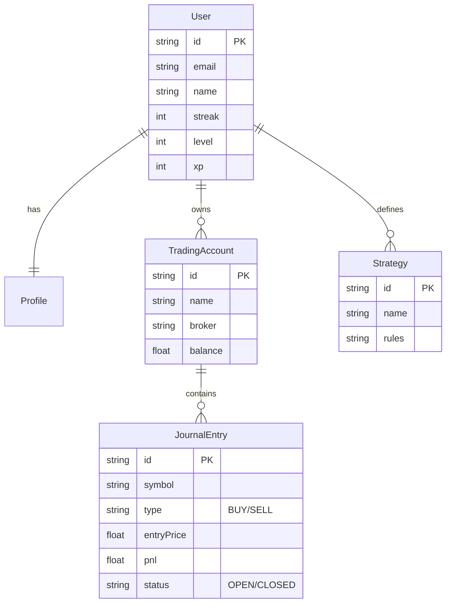

# Database Schema

This document outlines the core data models used in the **TheNextTrade** application. The database is hosted on **Supabase** (PostgreSQL) and managed via **Prisma ORM**.

## Core Entities Relationship Diagram

## detailed Models

### 1. User & Authentication
The `User` model mirrors `auth.users` from Supabase for easier relational queries.
- **Profile**: Extended user information (role, bio, username).
- **Gamification**: Fields like `streak`, `level`, `xp` are stored directly on `User` for quick access.

### 2. Trading System
This is the core of the application.

- **TradingAccount**: Represents a real Broker account (e.g., Exness, ICMarkets).
    - Can have multiple accounts per user.
    - Tracks `balance`, `currency`, and `platform` (MT4/5).

- **JournalEntry**: A single trade record.
    - Linked to a `TradingAccount`.
    - Stores technical data (`entryPrice`, `sl`, `tp`, `lotSize`).
    - Stores psychological data (`emotionBefore`, `emotionAfter`, `confidenceLevel`).
    - Can be linked to a `Strategy`.

- **Strategy**: User-defined trading rules.
    - Users can tag trades with a strategy to analyze performance (e.g., "SMC", "Price Action").

### 3. Education (Academy)
LMS content structure with 12-level curriculum.

- **Level** -> **Module** -> **Lesson**.
- **12 Levels:** Getting Started → Forex Basics → Protect Your Money → Price Action → Technical Tools → Strategy Building → Trader Mindset → Advanced Concepts → Trading Systems → Risk Mastery → Psychology & Performance → Funded Trader Path
- **UserProgress**: Tracks which lessons a user has completed.
- **Quiz/Question/Option**: Assessment system.

#### Lesson Model (Updated 2026-04-03)
New fields for AI content pipeline and SEO:
- `metaDescription` (VARCHAR 200) — SEO meta description
- `rawContent` (TEXT) — Original scraped content (pre-rewrite)
- `sourceUrls` (TEXT[]) — URLs used for multi-source rewrite
- `tone` (VARCHAR 30) — AI tone used (e.g. "conversational", "mentor")
- `status` default: `draft`

### 4. Profile (Public Profile)
New public profile fields (2026-04-03):
- `is_public_profile`, `profile_headline`
- `show_badges`, `show_pair_stats`, `show_session_stats`, `show_trade_score`
- Index on `username` for fast lookups

## Data Flow
1. **User Sign Up**: Trigger creates a `User` record in public schema from Supabase Auth.
2. **Trading**: User creates `JournalEntry`. Triggers/Hooks may update `TradingAccount` balance.
3. **Gamification**: Completed lessons or logged trades increment `xp` and `streak`.

## Migration History
| Migration | Description |
|-----------|-------------|
| `20260402231541_sync_academy_and_profile` | Academy SEO fields, Profile public fields, Quote/Feedback/Challenge restructure |

## Production Deployment
Use `prisma/run-sql-production.js` to execute raw SQL on Supabase when Prisma migrate cannot be used directly.

