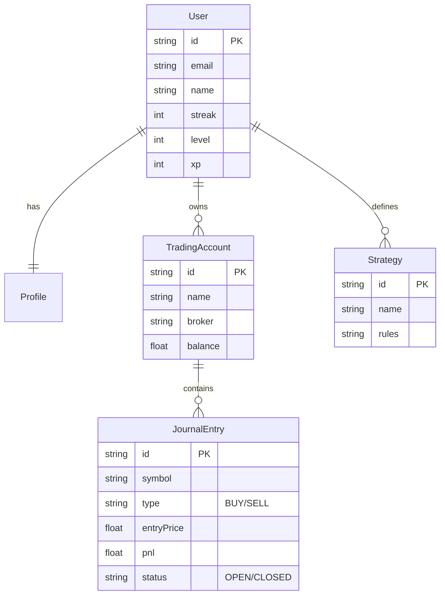

# Database Schema

This document outlines the core data models used in the **GSN-CRM** application. The database is hosted on **Supabase** (PostgreSQL) and managed via **Prisma ORM**.

## Core Entities Relationship Diagram

## detailed Models

### 1. User & Authentication
The `User` model mirrors `auth.users` from Supabase for easier relational queries.
- **Profile**: Extended user information (role, bio, username).
- **Gamification**: Fields like `streak`, `level`, `xp` are stored directly on `User` for quick access.

### 2. Trading System
This is the core of the application.

- **TradingAccount**: Represents a real Broker account (e.g., Exness, ICMarkets).
    - Can have multiple accounts per user.
    - Tracks `balance`, `currency`, and `platform` (MT4/5).

- **JournalEntry**: A single trade record.
    - Linked to a `TradingAccount`.
    - Stores technical data (`entryPrice`, `sl`, `tp`, `lotSize`).
    - Stores psychological data (`emotionBefore`, `emotionAfter`, `confidenceLevel`).
    - Can be linked to a `Strategy`.

- **Strategy**: User-defined trading rules.
    - Users can tag trades with a strategy to analyze performance (e.g., "SMC", "Price Action").

### 3. Education (Academy)
LMS content structure.

- **Level** -> **Module** -> **Lesson**.
- **UserProgress**: Tracks which lessons a user has completed.
- **Quiz/Question/Option**: Assessment system.

## Data Flow
1. **User Sign Up**: Trigger creates a `User` record in public schema from Supabase Auth.
2. **Trading**: User creates `JournalEntry`. Triggers/Hooks may update `TradingAccount` balance.
3. **Gamification**: Completed lessons or logged trades increment `xp` and `streak`.
