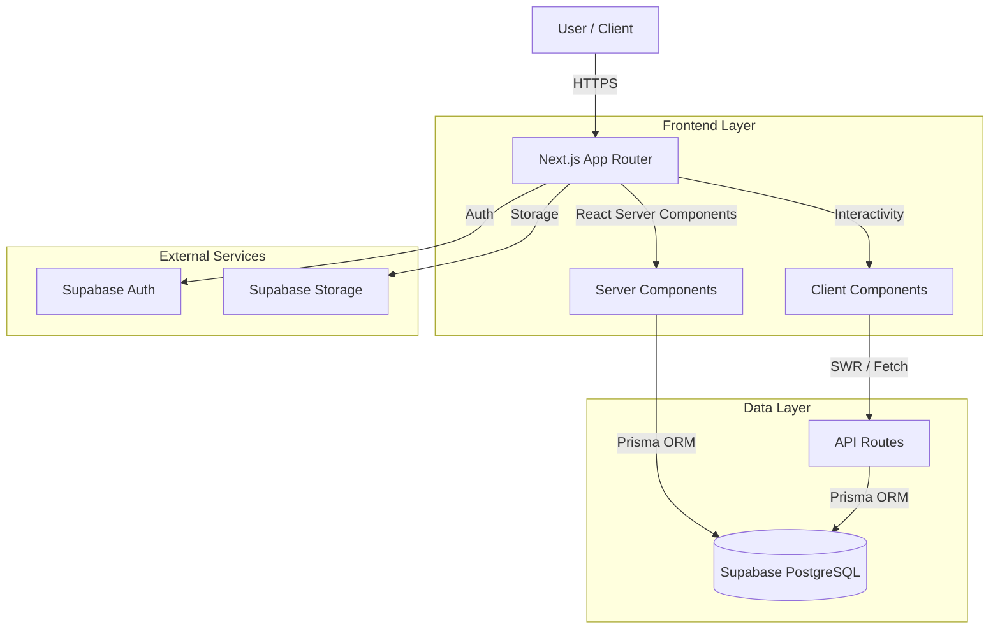

# Project Overview & Architecture

## 1. Introduction
**TheNextTrade** is a comprehensive CRM and Analytics platform designed for Forex/Crypto traders. It helps traders track their performance, manage strategies, monitor psychology, and improve their edge through data-driven insights.

## 2. Technology Stack

### Frontend
- **Framework:** Next.js 14+ (App Router)
- **Language:** TypeScript
- **Styling:** Tailwind CSS (with custom "Breek Premium" design system)
- **Icons:** Lucide React
- **Charts:** Recharts
- **State Management:** React Hooks & Context API

### Backend & Database
- **BaaS:** Supabase (PostgreSQL, Auth, Realtime)
- **ORM:** Prisma
- **API:** Next.js API Routes (Serverless functions)

## 3. System Architecture

## 4. Key Modules
- **Dashboard:** Main command center for traders.
- **Journal:** Detailed trade logging and history.
- **Analytics:** Advanced performance metrics, heatmaps, and equity curves.
- **Academy:** Educational content and quizzes.
- **Admin Panel:** User and content management.

## 4. Design Principles
- **Mobile First:** All interfaces are responsive.
- **Dark Mode Support:** Native support for light/dark themes.
- **Performance:** Server Components for heavy lifting, Client Components for interactivity.
