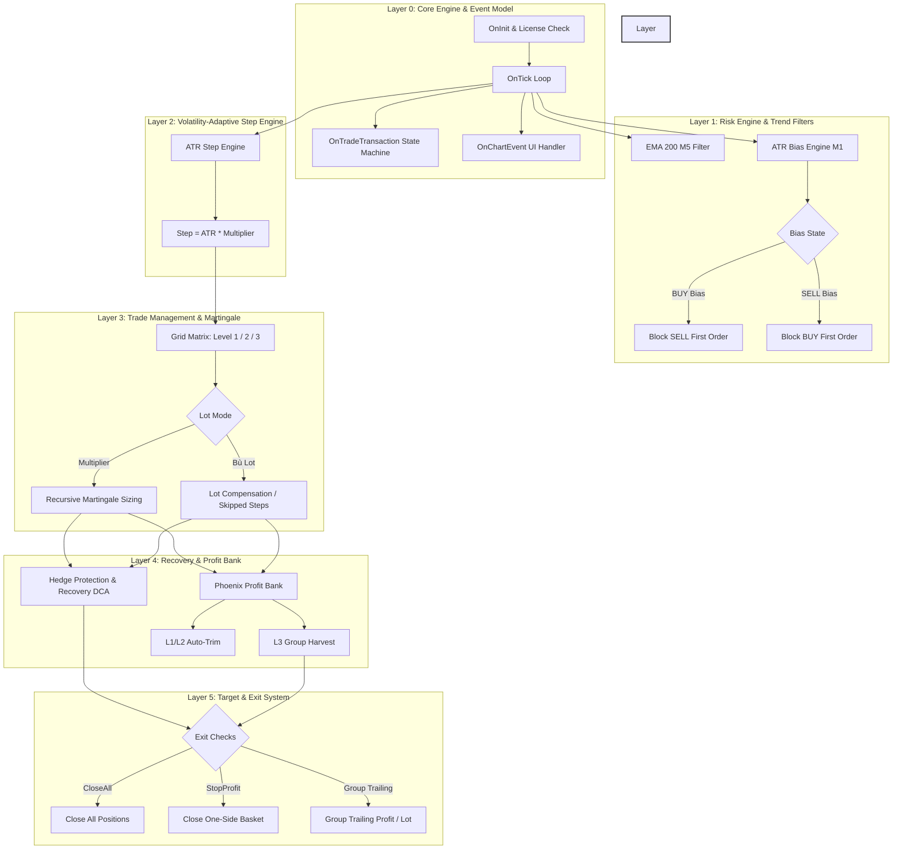
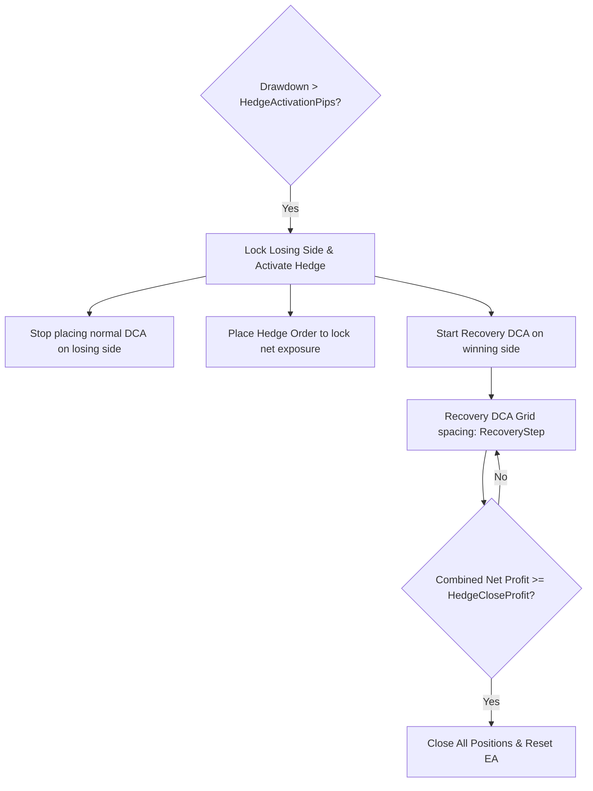
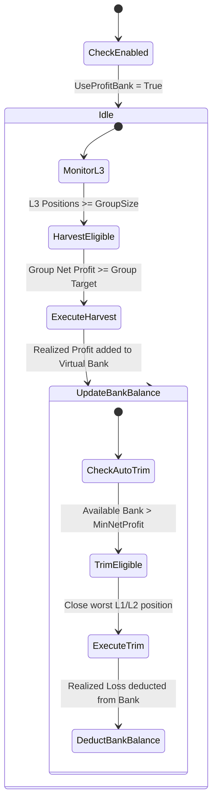

# GoldScalperNinja - PHOENIX GRID Master Specification

> **Version:** 4.0 (Consolidated Master Reference with MLPS)  
> **Platform:** MetaTrader 5 (MT5)  
> **Target Symbol:** XAUUSD (Gold)  
> **Timeframe:** M1 (Recommended for indicator calculations)  
> **Architecture:** 5-Layer Modular Architecture (Risk, Regime, Signal, Trade, Analytics)  

---

## 1. Executive Summary & Core Philosophy

**GoldScalperNinja - PHOENIX GRID** is a professional-grade, dual-direction grid trading system designed specifically for the highly volatile XAUUSD (Gold) market. Unlike traditional grid/martingale Expert Advisors (EAs) that run static spacing until margin exhaustion, Phoenix Grid is built on the philosophy of **Adaptive Survival**. 

The EA operates in two distinct phases:
1. **The Harvesting Phase (Sideways Markets):** Harvesting steady profits from short-term oscillations using tight volatility-adjusted spacing, high-frequency execution, and group trailing profits.
2. **The Survival Phase (Trending Markets):** Protecting the account during major macroeconomic news spikes (NFP, FOMC, CPI) by transitioning spacing and multiplier levels dynamically, implementing a non-blocking trend bias filter, and utilizing a sophisticated **Hedge Protection & Recovery DCA** module to exit the basket at a small, net-neutral profit.

Additionally, the **Phoenix Profit Bank** module dynamically harvests profits from the deepest martingale layers (Level 3) during localized oscillations and uses those virtual funds to "peel off" (trim) the oldest, highest-drawdown positions (Level 1 & 2), bringing the basket's break-even price closer to the current market price without waiting for a full market retracement.

### 1.1 Core Benefits & Value Proposition
* **Unprecedented Drawdown Protection:** By combining H1 macro filters and Dow Theory swing breakout detections, the EA actively blocks entries or delays grids when the market moves in a strong trend, preventing premature margin call conditions.
* **Capital Velocity & Flexibility:** The **Profit Bank** trinks realized scalp profits to trim historical, losing layers. This reduces the margin requirement and allows the account's capital to recycle efficiently instead of being locked in long-term drawdown.
* **Robust Macro-News Resistance:** Under high-impact news spikes (NFP, CPI, interest rates), the Volatility Spike Filter instantly detects the movement and stretches the step distances, preventing the EA from stacking large lot sizes in a narrow price corridor.
* **Trend-Following Profit Accrual:** The **Pyramid Mode** enables the system to safely pile up smaller lot positions in the direction of a strong breakout, generating additional income stream to offset any adverse grid drawdowns.
* **State Persistence & Crash Recovery:** In the event of VPS failures, terminal crashes, or platform restarts, the EA retains all critical runtime states in Global Variables (GVs), ensuring seamless continuation of grid logic and profit bank tracking.

### 1.2 Key Functional Features
* **Phoenix Grid System:** A dynamic, multi-tier adverse DCA grid. It dynamically splits into Level 1 (scalping), Level 2 (caution), and Level 3 (survival) step and multiplier parameters to match market conditions.
* **Profit Bank Engine:** Real-time collection of scalping profits to fund the closure (trimming) of worst-performing Level 1 and Level 2 adverse positions.
* **Auto-Hedge & Recovery Module:** Automatic drawdown locking via delta-neutral opposite positions, resolved through an isolated trend-following recovery grid.
* **Pyramid Grid:** Trend-following adding with fixed lot sizes and strict cumulative volume control (`PyramidMaxLotSide`).
* **Sonic R Trend Filtering:** Exponential Moving Averages 34 and 89 on the M15 timeframe acting as a gating mechanism for first-order entries.

---

## 2. Comprehensive System Architecture

Phoenix Grid follows a strict **5-Layer Modular Model** where each layer operates independently and passes sanitized states to the next layer:



---

## 3. Core Grid & Volatility-Adaptive Step Engine

### 3.1 First Order Placement
The grid cycle begins with a pending Stop order placed at a distance from the current price, rather than entering immediately at market price. This prevents entering right at the start of a trend breakout.
* **Adverse DCA First Step Distance:**
  $$\text{FirstStep} = \text{inputFirstStep} \ (\text{default: } 30 \text{ points})$$

### 3.2 Volatility-Adaptive Grid Spacing (ATR Engine)
When `UseATR` is enabled, the EA dynamically stretches or compresses grid spacing based on market volatility to prevent placing orders too close together during rapid market moves:
$$\text{Current Step} = \text{ATR}(14) \times \text{ATRStepMultiplier}$$
* **Constraint Boundaries:**
  $$\text{ATRMinStepPoints} \le \text{Current Step} \le \text{ATRMaxStepPoints}$$
  *(e.g., restricted between 50 and 500 points to prevent extreme values)*
* **Wide Grid Transition:** If the number of filled grid layers on one side exceeds `iCount` (default: 10), the spacing between subsequent orders automatically switches from the current step to a wider grid:
  $$\text{Wide Spacing} = \text{Step1} \ (\text{default: } 200 \text{ points})$$
  $$\text{Wide Distance} = \text{MinDistance1} \ (\text{default: } 200 \text{ points})$$

### 3.3 Martingale Lot Sizing Modes
The EA provides two primary methods for calculating the lot sizes of subsequent grid layers, selectable per risk level:

#### Mode 1: Multiplier Mode (`LOT_MODE_MULTIPLIER`)
Calculates martingale layers using a true recursive progressive formula. Unlike simple multiplier EAs where the addition (`PlusLot`) is added after the multiplication, Phoenix Grid compounds the addition recursively:
$$\text{Lot}(n) = \text{Lot}(n-1) \times \text{Multiplier} + \text{PlusLot}$$
*Example with Base Lot = 0.01, Multiplier = 1.2, PlusLot = 0.01:*
* *Layer 1:* $0.01$
* *Layer 2:* $(0.01 \times 1.2) + 0.01 = 0.02$
* *Layer 3:* $(0.02 \times 1.2) + 0.01 = 0.03$

#### Mode 2: Bù Lot / Lot Compensation Mode (`LOT_MODE_BULOT`)
Designed to handle price spikes where the broker skips pending stop orders due to lack of liquidity or high slippage. 
1. The EA calculates the number of skipped steps during a rapid price movement:
   $$\text{Theoretical Steps} = \text{Floor}\left(\frac{\text{Distance Skipped}}{\text{Grid Step}}\right)$$
2. It calculates the target grid step index:
   $$\text{Target Step} = \text{Current Filled Count} + \text{Theoretical Steps} - 1$$
3. It computes the lot size of the skipped orders and sums them up:
   $$\text{Skipped Lot Sum} = \sum_{i=\text{Current Count}}^{\text{Target Step} - 1} \text{LotAtStep}(i)$$
4. The next entered order's lot size is the sum of the standard next layer lot plus the compensated sum:
   $$\text{Total Entry Lot} = \text{LotAtStep}(\text{Target Step}) + \text{Skipped Lot Sum}$$
This ensures the basket's average price is aggressively pulled closer to the market price during a spike, allowing for a quick recovery on the first minor retracement.

---

## 4. Target & Risk Management

Phoenix Grid monitors the combined floating profit/loss of the account on every tick and applies a prioritized order of exit logic.

### 4.1 Prioritized Exit Cascade
On every tick, the EA evaluates exit conditions in the following strict order of priority:

```text
Priority 1: Equity Protection (Max Loss / StopLoss Check)
    ├── If Hit → Trigger f0_1(0) [Close All] and stop EA.
Priority 2: Hedge Close Target
    ├── If Hedge Mode is Active AND Total Basket Profit >= HedgeCloseProfit ($10)
    └── Trigger f0_1(0) [Close All] and reset Hedge State.
Priority 3: Basket CloseAll Target
    ├── If Total Basket Profit (Buy PnL + Sell PnL) >= CloseAll ($50)
    └── Trigger f0_1(0) [Close All] and handle Last Round.
Priority 4: One-Side StopProfit Target
    ├── Allowed ONLY if BOTH sides are above the MaxLossCloseAll threshold (e.g. both sides > -$15)
    ├── If Buy PnL >= StopProfit ($80) → Close Buy Side via f0_1(1)
    └── If Sell PnL >= StopProfit ($80) → Close Sell Side via f0_1(-1)
Priority 5: Group Trailing Profit
    ├── Active when NOT in Hedge Mode
    └── Track peak profit per lot and close side if it drops.
```

### 4.2 Group Trailing Profit Logic
Instead of a standard trailing stop on price, the EA trails the **realized profit per lot** of the basket. This makes trailing independent of symbol contract size or leverage:
1. **Lợi nhuận trên mỗi Lot hiện tại:**
   $$\text{ProfitPerLot} = \frac{\text{PnL}_{\text{Side}}}{\text{TotalLots}_{\text{Side}}}$$
2. **Kích hoạt Trailing:** Activated when the peak profit per lot reaches the threshold:
   $$\text{PeakProfit}_{\text{Side}} \ge \text{TrailingStopActivation} \ (\text{default: } \$30/\text{lot})$$
3. **Chốt lệnh:** If the profit per lot retraces from its peak by the trailing point distance, the entire side is closed:
   $$\text{PeakProfit}_{\text{Side}} - \text{ProfitPerLot} \ge \text{TrailingStopPoints} \ (\text{default: } \$50/\text{lot})$$
*Note:* If a new DCA order or Pyramid order is filled, the peak tracker is reset to prevent a premature trailing trigger due to the sudden lot size change.

---

## 5. Adaptive Risk Levels

To survive sustained, multi-thousand point trends, the EA transitions its spacing and multipliers across **three adaptive levels** based on the floating loss of the individual side.

| Risk Level | Activation Threshold | Step Size | Lot Sizing Mode | Typical Lot Multiplier | Description |
|---|---|---|---|---|---|
| **Level 1** | Always active ($\ge \$0$ loss) | `Level1Step` (e.g., 120 pts) | `Level1LotMode` (usually Bù Lot) | `Level1LotMultiplier` (1.2x) | **Harvesting Mode:** Focuses on high-frequency trading in ranges. |
| **Level 2** | Floating Loss $>$ `Level2Threshold` (e.g., $\$2000$) | `Level2Step` (e.g., 180 pts) | `Level2LotMode` (usually Bù Lot) | `Level2LotMultiplier` (1.3x) | **Caution Mode:** Widens spacing to reduce margin speed. |
| **Level 3** | Floating Loss $>$ `Level3Threshold` (e.g., $\$9000$) | `Level3Step` (e.g., 360 pts) | `Level3LotMode` (usually Multiplier) | `Level3LotMultiplier` (1.3x) | **Survival Mode:** Maximizes grid distance, prepares for Profit Bank harvest. |

* **Anti-Oscillation Buffer:** To prevent the EA from rapidly flipping back and forth between levels at the boundary, a buffer is applied:
  $$\text{Level Transition Zone} = \text{Threshold} - \text{LevelBuffer} \ (\text{default: } \$100)$$

---

## 6. Hedge Protection & Recovery DCA Module

When a trend is extremely strong and floating drawdown threatens the account, the EA activates **Hedge Protection** to lock the losses and recover via a specialized trend-following grid.



### 6.1 Activation & Locking
* **Trigger:** When the floating loss of one side (in pips) exceeds `HedgeActivationPips` (default: 150 pips).
* **Smart Lock:** The EA immediately locks the losing side.
  * *If Buy side is losing:* Sell side becomes the **Recovery DCA** side. New Buy grid entries are completely blocked.
  * *If Sell side is losing:* Buy side becomes the **Recovery DCA** side. New Sell grid entries are completely blocked.
* **Sticky Mode:** Once Hedge Mode is activated, it remains locked and active until the entire basket (Buy + Sell) is closed out. It cannot be deactivated mid-cycle by a minor price pullback.

### 6.2 Recovery DCA Grid Rules
The winning side (the Recovery side) is allowed to place new grid orders to ride the trend and pull the overall break-even price. These orders use independent settings:
* **Base Lot:** `RecoveryLot` (default: 0.02)
* **Lot Multiplier:** `RecoveryLotMultiplier` (default: 1.3x)
* **Min Grid Spacing:** `RecoveryStep` (default: 600 points)
* **Pending Distance:** `RecoveryMinDistance` (default: 600 points)
* **Orders Per Layer:** `RecoveryGridStep` (default: 1)
* **Independence:** The lot sizing sequence of the Recovery grid is completely separate from the normal Adverse DCA grid. Harvesting or trimming events from the Profit Bank do not affect the lot sizing of the active Recovery grid.

### 6.3 Recovery Exit Target
The target to close the entire hedged basket is significantly reduced to ensure a quick escape:
$$\text{Target Profit} = \text{HedgeCloseProfit} \ (\text{default: } \$10)$$
When the combined net profit of all Buy and Sell positions reaches this target, the EA closes all orders and resets to normal status.

---

## 7. Trend Filters & Bias Engine

To prevent entering against strong trends, the EA incorporates a M5 EMA filter and a selectable M1 ATR Bias engine.

### 7.1 Sonic R EMA Trend Filter (EMA 34 & 89 on M15)
When `UseEMAFilter` is active, the EA compares the current price to the Exponential Moving Averages (EMA 34 and EMA 89) on the **M15 Timeframe**:
* **Buy Grid** (First Order) is only allowed to start if:
  $$\text{Current Price} > \text{EMA}(34) \quad \text{AND} \quad \text{Current Price} > \text{EMA}(89) \quad \text{AND} \quad \text{EMA}(34) > \text{EMA}(89)$$
* **Sell Grid** (First Order) is only allowed to start if:
  $$\text{Current Price} < \text{EMA}(34) \quad \text{AND} \quad \text{Current Price} < \text{EMA}(89) \quad \text{AND} \quad \text{EMA}(34) < \text{EMA}(89)$$

**Practical Utility & Benefit:**
* **Trend Alignment:** Filters out first-order entries that go against the medium-term market momentum.
* **Extreme Price Protection:** Prevents buying at local M15 swing peaks or selling at swing troughs, since price must pull away from the EMA tunnel in a structured manner.
* **Inside-Tunnel Flat Market Safety:** When the price is chop-trading inside the EMA 34 and 89 corridor, it signifies a transition phase (sideways/reversal), and the EA blocks new grid initialization to avoid getting caught in sudden breakouts.

### 7.2 M1 ATR & ADX Bias Engine Modes
The user can select the trend filtering mode via `ATRBiasMode`:

```text
[MODE 0] Disabled (BIAS_MODE_DISABLED)
    └── Grid orders open freely in both directions.

[MODE 1] Soft Bias (BIAS_MODE_SOFT)
    ├── Stretches the FirstStep of the opposite side.
    ├── Prioritized Side FirstStep = FirstStep * ATRBiasFirstStepRatio (default: 0.3)
    └── Opposed Side FirstStep = FirstStep * ATRBiasAntiStepRatio (default: 1.5)

[MODE 2] Hard Filter (BIAS_MODE_HARD)
    ├── Calculates MA 50 +/- (1.5 * ATR 14) bands.
    ├── Price > Upper Band → BUY Trend (completely blocks SELL First Order)
    └── Price < Lower Band → SELL Trend (completely blocks BUY First Order)

[MODE 3] XTO Trailing Stop (BIAS_MODE_XTO)
    ├── Projects a Chandelier-style trailing stop line on M1.
    ├── Under BUY Stop trend: completely blocks SELL First Order.
    └── Under SELL Trend trend: completely blocks BUY First Order.

[MODE 4] Soft ADX Bias (BIAS_MODE_ADX_SOFT)
    ├── Stretches the FirstStep of the opposite side when ADX value >= ADXThreshold.
    ├── Prioritized Side FirstStep = FirstStep * ATRBiasFirstStepRatio (default: 0.3)
    └── Opposed Side FirstStep = FirstStep * ATRBiasAntiStepRatio (default: 1.5)

[MODE 5] Hard ADX Filter (BIAS_MODE_ADX_HARD)
    ├── Evaluates trend direction using +DI and -DI indicators when ADX >= ADXThreshold.
    ├── Under BUY Trend (+DI > -DI): completely blocks SELL First Order.
    └── Under SELL Trend (-DI > +DI): completely blocks BUY First Order.
```

### 7.3 Hard Filter & XTO Technical Calculations
* **Hard Filter Volatility Band:**
  $$\text{Upper Band} = \text{SMA}(50) + (\text{ATRBiasMultiplier} \times \text{ATR}(14))$$
  $$\text{Lower Band} = \text{SMA}(50) - (\text{ATRBiasMultiplier} \times \text{ATR}(14))$$
  * *BUY Trend Trigger:* $\text{MidPrice} > \text{Upper Band}$ (Bias Strength = $\frac{\text{Mid} - \text{Upper}}{\text{ATR}}$)
  * *SELL Trend Trigger:* $\text{MidPrice} < \text{Lower Band}$ (Bias Strength = $\frac{\text{Lower} - \text{Mid}}{\text{ATR}}$)
* **XTO Trailing Stop Line:**
  Calculated recursively over the last 100 M1 bars.
  * *Under Buy Trend (Trend = 1):*
    $$\text{TrailingStop}(t) = \text{Max}\left(\text{TrailingStop}(t-1), \text{EMA}(50)_t - \text{Multiplier} \times \text{ATR}(14)_t\right)$$
    *If Close price breaks below TrailingStop, Trend flips to Sell (-1).*
  * *Under Sell Trend (Trend = -1):*
    $$\text{TrailingStop}(t) = \text{Min}\left(\text{TrailingStop}(t-1), \text{EMA}(50)_t + \text{Multiplier} \times \text{ATR}(14)_t\right)$$
    *If Close price breaks above TrailingStop, Trend flips to Buy (1).*

### 7.4 Automatic Pending Clean-up
If the trend flips direction:
* If the EA is now in a **BUY Trend**, and there are no open Buy positions (`NumBuy == 0`), any un-triggered pending BuyStop orders are immediately deleted.
* If the EA is now in a **SELL Trend**, and there are no open Sell positions (`NumSell == 0`), any un-triggered pending SellStop orders are immediately deleted.
* *Note:* Trend filtering **only** restricts the very first order of a grid. If a grid already has active open positions (`NumBuy > 0` or `NumSell > 0`), the EA is allowed to continue placing DCA layers to manage and recover the basket.

---

## 8. Phoenix Profit Bank Module

The **Phoenix Profit Bank** is a drawdown-reduction system designed to harvest profits from groups of Level 3 positions (large lot sizes) and use those funds to close out (trim) older, high-drawdown Level 1 & 2 positions.

### 8.1 Core Logic Flow
The entire Profit Bank lifecycle runs on every tick as follows:



### 8.2 L3 Group Harvesting Logic
When the number of open Level 3 positions on one side is greater than or equal to `ProfitBankGroupSize` (default: 3):
1. **Position Selection:** The EA selects the $N$ Level 3 positions with the best open prices (lowest entries for Buy, highest entries for Sell) to form the **Harvest Group**.
2. **Target Calculation:** The profit target is calculated dynamically based on the group's total volume:
   $$\text{Group Target} = \left( \frac{\text{Total Lots in Group}}{0.01} \right) \times \text{ProfitBankProfitPer001Lot}$$
   *Where `ProfitBankProfitPer001Lot` defaults to $1.0.*
3. **Execution:** If the combined net profit of these selected positions (including swaps and estimated commissions of $-0.07$ per 0.01 lot) is greater than or equal to the `Group Target`:
   * The EA closes the selected positions.
   * The realized net profit is added to the virtual bank:
     $$\text{Bank Balance} = \text{Bank Balance} + \text{Realized Profit}$$
   * The EA activates the **Re-entry Gate Lock** for the harvested side.

### 8.3 Re-entry Gate Lock
To prevent the EA from immediately re-entering new Level 3 positions at the same price zone after a harvest:
* **Trigger:** Activated on the side that was harvested (Buy or Sell).
* **Mechanism:** The open price of the furthest remaining position on that side is set as the **Anchor Price**.
* **Rule:** The EA blocks the creation of new Level 3 pending orders on that side until the market moves adversely by at least `Level3Step` points from the Anchor Price:
  $$\text{Current Price} \le \text{Anchor Price} - \text{Level3Step} \ (\text{for Buy})$$
  $$\text{Current Price} \ge \text{Anchor Price} + \text{Level3Step} \ (\text{for Sell})$$
* *Note:* The Re-entry Gate **only** blocks new Level 3 normal DCA entries. It **never** blocks Level 1, Level 2, Recovery DCA, or Pyramid orders.

### 8.4 Auto-Trimming Logic
If `ProfitBankAutoTrim` is enabled, the EA utilizes the accumulated virtual bank to cut losses on older positions:
1. **Available Balance:**
   $$\text{Available Bank} = \text{Bank Balance} \times \left(1.0 - \frac{\text{ProfitBankReservePercent}}{100.0}\right)$$
2. **Candidate Filtering:** The EA scans for open positions that are:
   * Normal DCA positions tagged as `L1` or `L2`.
   * Not Recovery or Pyramid positions.
   * Currently in a loss (`NetPnL < 0`).
3. **Sorting Priority:** Candidates are sorted to identify the single best candidate to trim:
   * **Priority 1:** Higher Risk Level first (Level 2 prioritized over Level 1).
   * **Priority 2:** Furthest open price from current market price.
   * **Priority 3:** Oldest position (earliest open time).
4. **Execution Check:** The best candidate is trimmed if the available bank can cover its loss while maintaining the minimum net profit margin:
   $$\text{Available Bank} + \text{Candidate Net PnL} \ge \text{ProfitBankMinNetProfit} \ (\text{default: } \$1.0)$$
   *(Since `Candidate Net PnL` is negative, this ensures the bank remains positive).*
5. **Deduction:** The position is closed, and the realized loss is deducted from the virtual bank:
   $$\text{Bank Balance} = \text{Bank Balance} - \text{Realized Loss}$$

### 8.5 Martingale Sequence Protection
To prevent the closing of L3 or L1/L2 positions from resetting or shrinking the martingale lot sizing of subsequent grid layers:
* The EA does **not** calculate the next layer's lot size using the raw number of currently open positions (`NumBuy` / `NumSell`).
* Instead, it uses persistent sequence counters: **`g_nextBuyLayerSequence`** and **`g_nextSellLayerSequence`**.
* These counters **only** increment when a new grid layer is successfully opened. They are **never** decremented when positions are harvested by the Profit Bank or trimmed.
* The sequence counters and the virtual bank balance are reset to 0 only when the entire basket is fully cleared (0 open positions).

---

## 9. Advanced Trim Systems (Smart Trim)

When the Profit Bank module is inactive (`UseProfitBank = false`), the EA falls back to two legacy smart trim systems to reduce basket drawdown:

### 9.1 ChainProfit Trim (`UseChainProfitTrim`)
* **Trigger:** If the total floating loss of the basket exceeds `ChainProfitThreshold` (default: $-\$1000$).
* **Mechanism:** The EA calculates the total accumulated closed profit of the account for the current day. If this profit is positive, the EA uses it as a "budget" to close out the oldest, highest-drawdown losing positions.
* **Result:** Floating loss is converted into realized loss, but the net account equity remains stable while reducing the margin load.

### 9.2 One-Win Trims N-Losses (`UseLaiTiaNhieuLo`)
* **Mechanism:** The EA pairs the single most profitable position in the basket with the oldest, most unprofitable positions.
* **Rule:** If the net profit of the winning position plus the net loss of the losing positions is greater than or equal to `MinTrimProfit` (default: $+\$5.0$), the EA closes all paired positions simultaneously.
* *Note:* Both legacy trim systems are **automatically disabled** at runtime when `UseProfitBank = true` to prevent double-spending profits.

---

## 10. Pyramid System (Trend-Following Grid)

While the Adverse DCA grid operates against the market direction to average down entries, the **Pyramid System** operates *with* the trend to compound profits during strong directional runs.

* **Trigger:** Enabled via `UsePyramid = true`.
* **Direction:** Places trades in the direction of the trend:
  * *Buy Pyramid:* Opened at higher prices than the previous Buy.
  * *Sell Pyramid:* Opened at lower prices than the previous Sell.
* **Sizing:** Uses a fixed lot size: `PyramidLot` (default: 0.01).
* **Spacing:** Minimum distance between entries: `PyramidStep` (default: 100 points).
* **Limits:** To prevent over-exposure:
  * **Max Lots:** Cumulative pyramid volume cannot exceed `PyramidMaxLotSide` (default: 0.5 lots).
  * **Max Orders:** Number of active pyramid orders cannot exceed `PyramidMaxOrders` (default: 5).
* **Comment Tagging:** All pyramid orders are tagged with the comment `Pyramid` to ensure they are excluded from martingale lot calculations and Profit Bank trimming.

---

## 11. Chart Panel & Legacy Objects UI

The EA features a dark-themed interactive panel on the chart, rendering account stats, signal filters, trading inputs, and control toggles.

### 11.1 Display Metrics
* **ACCOUNT Section:** Balance, Equity (formatted with comma thousands separators via `FormatMoney()`), Net Floating P&L, Current Drawdown %, Max Drawdown % recorded today, and Today's realized P&L.
* **SIGNAL Section:** Active trend bias and strength (e.g., `BIAS: BUY (+1.27)`).
* **TRADING Section:** Base Lot Size, Lot Multiplier, Adverse Max Lot, and Minimum Spacing.
* **HEDGE Section:** Recovery Lot, Multiplier, and Max Lot. Shows `READY` or `ACTIVE`.
* **PROFIT BANK Section:** Current virtual bank balance, Available balance, L3 position counts, Group size, and Harvest/Trim operational states (READY / WAIT / LOCKED / OFF).

### 11.2 Panel Controls & State Preservation
The panel features interactive buttons:
* **`BUY: ON/OFF`** / **`SELL: ON/OFF`**: Toggle grid directions.
* **`EA: ON/OFF`**: Master switch to enable/disable trading.
* **`HEDGE: ON/OFF`**: Manually enable/disable the hedge module.
* **`CLOSE ALL`**: Instantly triggers the async closure of all positions.
* **`LAST ROUND`**: Once toggled ON, the EA will continue running the current basket normally, but after the basket closes (via CloseAll or Hedge Close), the EA will automatically turn itself OFF (`EA: OFF`) and place no new first orders.
* **`APPLY SETTINGS`**: Save edited values from input boxes into runtime memory.
* **State Preservation on Chart Change:** When the chart timeframe is changed, or the chart is resized, MT5 triggers `CHARTEVENT_CHART_CHANGE`. The EA caches the state of all 7 interactive buttons, deletes the old panel objects, recreates the panel, and restores the button states to prevent settings from resetting.
* **Flicker Mitigation:** To prevent the panel from flashing on every tick, the EA caches the chart dimensions (`g_lastChartW` / `g_lastChartH`). The panel is only recreated if the chart dimensions actually change. Standard tick updates only modify the text properties of existing objects instead of recreating them.

---

## 12. State Persistence & Restart Safety

To ensure the EA can safely recover after a terminal crash, power loss, or VPS restart, all critical runtime variables are persisted in MT5 **Global Variables (GV)** on every state change.

### 12.1 Persistent Fields
The GV keys are formatted as follows to prevent conflicts between different instances:
`PHX_PB_<Login>_<Symbol>_<Magic>_<Field>`

| Field | Key Suffix | Type | Description |
|---|---|---|---|
| **Bank Balance** | `_bal` | `double` | The accumulated virtual profit bank balance. |
| **Buy Sequence** | `_bseq` | `int` | Persistent martingale layer index for Buy. |
| **Sell Sequence** | `_sseq` | `int` | Persistent martingale layer index for Sell. |
| **Buy L3 Lock** | `_block` | `bool` | Re-entry gate lock state for Level 3 Buy. |
| **Sell L3 Lock** | `_slock` | `bool` | Re-entry gate lock state for Level 3 Sell. |
| **Buy Anchor Price**| `_banch` | `double` | Price level used to calculate the Buy L3 re-entry gate. |
| **Sell Anchor Price**| `_sanch` | `double` | Price level used to calculate the Sell L3 re-entry gate. |

### 12.2 Restart Recovery Sequence
1. **OnInit:** The EA checks if the GV keys exist for its specific Login, Symbol, and Magic number.
2. **State Loading:** If found, the values are loaded into the global variables `g_profitBankBalance`, `g_nextBuyLayerSequence`, `g_nextSellLayerSequence`, etc.
3. **Reconciliation:** The EA scans all open positions on the chart and reconciles them with the loaded sequences to ensure no mismatch.
4. **Cleanup:** When the entire basket is closed out (0 positions remaining), all persistent GV keys for that instance are automatically deleted from the terminal memory.

---

## 13. System Mathematics Summary

### Martingale Lot Sizing (Multiplier Mode)
$$Lot(n) = Lot(n-1) \times Multiplier + PlusLot$$

### Martingale Lot Sizing (Bù Lot Mode)
$$Lot_{\text{Comp}} = Lot(Target) + \sum_{i=Current}^{Target - 1} Lot(i)$$

### Dynamic ATR Grid Spacing
$$Step = \text{Clamp}\left( ATR(14) \times Multiplier, \ MinStep, \ MaxStep \right)$$

### Dynamic ATR Bias Strength (Hard Filter)
$$Strength_{\text{Buy}} = \frac{Price_{\text{Mid}} - \left( MA(50) + Multiplier \times ATR(14) \right)}{ATR(14)}$$
$$Strength_{\text{Sell}} = \frac{\left( MA(50) - Multiplier \times ATR(14) \right) - Price_{\text{Mid}}}{ATR(14)}$$

### Group Trailing Profit Target
$$Activation_{\text{Side}} = TotalLots_{\text{Side}} \times TrailingStopActivation$$
$$Exit_{\text{Side}} = PeakProfit_{\text{Side}} - \left( TotalLots_{\text{Side}} \times TrailingStopPoints \right)$$

### Profit Bank L3 Harvest Target
$$Target_{\text{Group}} = \left( \frac{\sum_{i=1}^{N} Lot_{\text{L3}}(i)}{0.01} \right) \times ProfitBankProfitPer001Lot$$

### Profit Bank L1/L2 Trim Check
$$\text{Available Bank} \times \left(1.0 - \frac{\text{ReservePercent}}{100.0}\right) + \text{NetPnL}_{\text{Candidate}} \ge \text{MinNetProfit}$$
*(Note: $\text{NetPnL}_{\text{Candidate}}$ is a negative value representing the loss of the position).*

---

## 14. Multi-Layered Protection System (MLPS)

The **Multi-Layered Protection System (MLPS)** is a modular, high-speed defensive framework designed to protect the EA from massive, persistent trend runs (such as Gold's 25,000-point single-direction drops) and high-impact macroeconomic news spikes. It operates at three distinct analytical levels, combining higher-timeframe structural stability (H1) with lower-timeframe reaction speed (M5).

### 14.1 Layer 1: Macro-Trend Direction Filter (H1 Confluence)
* **Objective:** Prevents entering new grid cycles against the prevailing macro trend.
* **Mechanism:** Monitors the alignment of a Fast EMA (50) and a Slow EMA (200) on the **H1 Timeframe**.
* **Rules:**
  * **Strong Bearish Trend:** If $\text{EMA}(50)_{\text{H1}} < \text{EMA}(200)_{\text{H1}}$ AND $\text{Close}_{\text{H1}} < \text{EMA}(50)_{\text{H1}}$.
    * *Action:* Block the opening of the first Buy order (`allowBuyFirstOrder = false`).
  * **Strong Bullish Trend:** If $\text{EMA}(50)_{\text{H1}} > \text{EMA}(200)_{\text{H1}}$ AND $\text{Close}_{\text{H1}} > \text{EMA}(50)_{\text{H1}}$.
    * *Action:* Block the opening of the first Sell order (`allowSellFirstOrder = false`).
* **Practical Utility & Benefit:**
  * **Macro Trend Confluence:** Avoids building a buy grid when the hourly chart is in a clear, deep bear trend (or a sell grid in a strong bull trend). This eliminates the risk of trying to catch major macro-level market reversals.

### 14.2 Layer 2: Volatility Spike Filter (M5 Price Action)
* **Objective:** Instantly stretches grid spacing during sudden vertical price drops or surges (NFP, CPI spikes) to prevent the EA from placing multiple DCA layers too close together.
* **Mechanism:** Measures the high-to-low range of the current M5 candle in real-time and compares it to the M5 ATR:
  $$\text{Candle Range}_{\text{M5}} = \text{High}_{\text{M5}} - \text{Low}_{\text{M5}}$$
* **Spike Detection:** Triggered when the range exceeds the multiplier threshold:
  $$\text{Candle Range}_{\text{M5}} > \text{MLPS\_SpikeMultiplier} \times \text{ATR}(14)_{\text{M5}} \quad (\text{default: } 2.5\text{x})$$
* **Grid Stretching & Cooling Period:**
  * Once a spike is detected, the EA marks the timestamp `g_mlpsLastSpikeTime` and enters a **15-minute cooling period**.
  * If the spike was downward ($\text{Close}_{\text{M5}} < \text{Open}_{\text{M5}}$): The grid step and minimum distance for the **BUY** side are multiplied by `MLPS_GridStretchRatio` (default: 2.0x):
    $$\text{buyStep} = \text{buyStep} \times 2.0$$
    $$\text{buyMinDistance} = \text{buyMinDistance} \times 2.0$$
  * If the spike was upward ($\text{Close}_{\text{M5}} > \text{Open}_{\text{M5}}$): The grid step and minimum distance for the **SELL** side are multiplied by 2.0x.
* **Practical Utility & Benefit:**
  * **Avoiding Falling Knives:** High-impact news releases usually cause price to shoot vertically in 1-2 minutes. A normal grid EA would open several layers within this narrow corridor, accumulating massive lot sizes at terrible prices. The Spike Filter stretches these distances, forcing the EA to wait until the price expansion decelerates before adding new positions.

### 14.3 Layer 3: Momentum Strength & Dow Theory Structure Filter
* **Objective:** Protects the EA from structural breakout continuation.
* **Momentum Filter (ADX M5):**
  * Monitors ADX(14) on the M5 timeframe.
  * If $\text{ADX}_{\text{M5}} > \text{MLPS\_ADXThreshold} \quad (\text{default: } 35)$:
    * If $\text{-DI} > \text{+DI}$ (strong bearish momentum): Block BUY first order (`allowBuyFirstOrder = false`).
    * If $\text{+DI} > \text{-DI}$ (strong bullish momentum): Block SELL first order (`allowSellFirstOrder = false`).
  * **Practical Utility & Benefit:** ADX measures trend strength. When ADX > 35, the trend is exceptionally strong and unlikely to reverse immediately. Blocking counter-trend entries at this point saves the EA from opening trades in the path of a powerful market trend.
* **Structure Filter (Dow Theory Swing Breakout):**
  * Computes the Swing High and Swing Low of the last $N$ H1 bars (default: 20 bars, representing the weekly high/low range).
  * **Bearish Structure Breakout:** If the current bid price breaks below the H1 Swing Low ($\text{Bid} < \text{SwingLow}_{\text{H1}}$):
    * Block BUY first order.
    * If a BUY basket is already open (`NumBuy > 0`), the EA **instantly promotes the BUY grid step and minimum distance to Level 3 Step (1800 points)**, regardless of the current floating drawdown:
      $$\text{buyStep} = \max(\text{buyStep}, \text{Level3Step})$$
      $$\text{buyMinDistance} = \max(\text{buyMinDistance}, \text{Level3Step})$$
  * **Bullish Structure Breakout:** If the current ask price breaks above the H1 Swing High ($\text{Ask} > \text{SwingHigh}_{\text{H1}}$):
    * Block SELL first order.
    * If a SELL basket is already open (`NumSell > 0`), the EA instantly promotes the SELL grid step and minimum distance to Level 3 Step (1800 points).
  * **Practical Utility & Benefit:** Breaks of weekly swing highs or lows indicate a macro-level breakout. A standard grid would get heavily burdened here. By immediately raising the grid spacing to the maximum (Level 3 Step), the EA stops scaling in until the price has traveled significantly further or stabilized, mitigating massive drawdown during macro market shifts.
