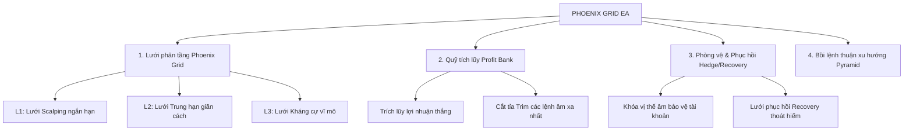

# HƯỚNG DẪN SỬ DỤNG VÀ ĐẶC TẢ TÍNH NĂNG EA
# GOLD SCALPER NINJA - PHOENIX GRID (VIETNAMESE EDITION)

---

## 1. GIỚI THIỆU TỔNG QUAN

**GoldScalperNinja - PHOENIX GRID** là một hệ thống giao dịch tự động chuyên biệt cho thị trường Vàng (XAUUSD). Khác với các hệ thống Grid (Lưới) truyền thống thường gặp rủi ro cháy tài khoản khi thị trường đi xu hướng mạnh (Trend), PHOENIX GRID được thiết kế theo triết lý **"Giao dịch Lưới kết hợp Tái cơ cấu và Phòng vệ đa tầng"**. 

Hệ thống tích hợp công nghệ quản lý trạng thái thông minh, quỹ tích lũy lợi nhuận (Profit Bank), cơ chế bảo hiểm đóng băng trạng thái (Auto-Hedge & Recovery), và hệ thống bảo vệ đa tầng chống biến động mạnh (Multi-Layered Protection System - MLPS).

---

## 2. LỢI ÍCH CỐT LÕI CỦA BOT

> [!NOTE]
> **Phoenix Grid giải quyết bài toán lớn nhất của giao dịch Lưới: Làm sao để sống sót qua những đợt bão giá cực mạnh của Vàng và tiếp tục sinh lời bền vững?**

* **Khả năng sống sót vượt trội:** Không bao giờ gồng lệnh vô hạn. Hệ thống tự động nhận biết điểm nguy hiểm để kích hoạt cơ chế khóa phòng vệ (Hedge) đóng băng rủi ro tại mức an toàn.
* **Tái cơ cấu rổ lệnh thông minh:** Sử dụng thuật toán **Profit Bank** (Quỹ tích lũy lợi nhuận). Bot sẽ trích doanh thu từ những lệnh thắng ngắn hạn để âm thầm cắt tỉa (Trim) các lệnh âm lớn nhất ở xa nhất, giúp rổ lệnh liên tục được rút ngắn và dịch chuyển điểm hòa vốn (Break-even) về gần giá hiện tại hơn.
* **Bộ lọc xu hướng chuẩn xác:** Kết hợp các hệ thống Sonic R vĩ mô và bộ lọc ADX vi mô để đảm bảo lệnh đầu tiên (First Order) luôn đi đúng hướng sóng, hạn chế tối đa việc mở lệnh ngược xu hướng.
* **Bảo vệ tài khoản tối đa (MLPS):** Hệ thống bảo vệ đa tầng tự động cảm nhận xung lực thị trường, giãn khoảng cách lưới hoặc khóa giao dịch khi có tin tức mạnh hoặc bão giá.
* **Tối ưu hóa lợi nhuận thuận xu hướng:** Tích hợp tính năng bồi lệnh tự động (Pyramid) khi xu hướng đang chạy mạnh giúp gia tăng biên lợi nhuận một cách an toàn mà không làm tăng rủi ro rổ lệnh ngược chiều.

---

## 3. CÁC CHỨC NĂNG CHÍNH CỦA BOT

Hệ thống được vận hành dựa trên 4 trụ cột chức năng chính:

### 3.1 Phoenix Grid System (Hệ thống Lưới phân tầng)
Lưới lệnh ngược chiều (Adverse DCA Grid) không sử dụng một khoảng cách cố định mà tự động phân chia thành 3 phân cấp dựa trên khoảng cách khoảng cách giá chạy ngược:
* **Level 1 (Giai đoạn Scalping):** Khoảng cách lưới ngắn (ví dụ: 600 points), lot multiplier nhỏ (1.2x) để tối ưu hóa việc ăn sóng hồi nhanh.
* **Level 2 (Giai đoạn Trung hạn):** Khi giá đi ngược quá ngưỡng thiết lập (ví dụ: 2,000 points), khoảng cách lưới tự động giãn ra (ví dụ: 1200 points) và LotMultiplier tăng nhẹ (1.3x) để bảo vệ tài khoản.
* **Level 3 (Giai đoạn Kháng cự vĩ mô):** Khi giá đi ngược cực xa (ví dụ: 9,000 points), khoảng cách lưới giãn tối đa (ví dụ: 1800 points) để ngăn việc tích lũy volume quá lớn ở vùng bão giá.

### 3.2 Profit Bank (Quỹ tích lũy lợi nhuận & Tái cơ cấu)
Khi rổ lệnh đang bị kẹt (ví dụ rổ lệnh BUY đang bị âm), EA vẫn liên tục tìm kiếm cơ hội Scalping ở hướng ngược lại hoặc tận dụng các sóng hồi ngắn để chốt lời.
* **Tích quỹ:** Lợi nhuận từ các lệnh đóng ngắn hạn này được trích một phần (ví dụ: 80%) đưa vào Quỹ tích lũy (Profit Bank).
* **Cắt tỉa (Trim):** Khi quỹ tích lũy đạt đủ điều kiện chi trả, EA sẽ dùng số tiền này để **đóng lệnh âm lớn nhất và xa nhất** của rổ lệnh đang kẹt, đồng thời bù trừ với số tiền trong quỹ. 
* **Lợi ích:** Rổ lệnh được giảm tải Volume đáng kể, điểm hòa vốn (Average TP) được kéo sát lại gần giá hiện tại hơn, giúp tài khoản thoát kẹt nhanh chóng mà không cần đợi giá quay về tận điểm xuất phát.

### 3.3 Auto-Hedge & Recovery Mode (Cơ chế đóng băng và Thoát hiểm)
Khi thị trường xảy ra thiên nga đen hoặc bão giá cực mạnh vượt ngoài tầm kiểm soát của Lưới Level 3:
* **Auto-Hedge:** Khi tổng trạng thái âm đạt mức giới hạn hoặc đạt cấp số lệnh nhất định, EA tự động mở một lệnh đối ứng (Hedge Order) có khối lượng bằng chính xác phần chênh lệch mua/bán. Từ lúc này, **Drawdown của tài khoản được đóng băng hoàn toàn**, không thể tăng thêm dù giá Vàng có chạy thêm bao nhiêu nghìn pips.
* **Recovery Mode:** EA sẽ tắt hệ thống lưới chính và khởi động lưới phục hồi (Recovery Grid) với các quy tắc quản lý vốn cực kỳ chặt chẽ. Hệ thống sẽ tỉa dần lệnh Hedge và rổ lệnh kẹt dựa trên mục tiêu lợi nhuận tối thiểu (`HedgeCloseProfit`). Mục tiêu là đưa tài khoản về điểm an toàn (hòa vốn hoặc lãi nhẹ) và khởi động lại từ đầu.

### 3.4 Pyramid Mode (Bồi lệnh thuận xu hướng)
Để tối ưu hóa lợi nhuận khi thị trường đi xu hướng rõ ràng:
* Khi xu hướng được xác nhận mạnh, EA sẽ bồi thêm các lệnh cùng chiều (Pyramid) với kích thước cố định (`PyramidLot`).
* **PyramidMaxLotSide:** Giới hạn trần tổng khối lượng của các lệnh bồi. Đảm bảo tổng lot bồi không vượt quá mức cho phép để tránh rủi ro đảo chiều đột ngột.

---

## 4. HỆ THỐNG CÁC LỚP BẢO VỆ (MLPS) & BỘ LỌC XU HƯỚNG

Sức mạnh phòng thủ của PHOENIX GRID nằm ở sự phối hợp nhịp nhàng giữa bộ lọc xu hướng cơ bản và hệ thống bảo vệ đa tầng MLPS.

| Lớp bộ lọc / Bảo vệ | Khung thời gian | Chỉ báo sử dụng | Mục đích & Lợi ích thực tế |
| :--- | :---: | :---: | :--- |
| **Sonic R EMA Filter** | **M15** | EMA 34 & EMA 89 | Định hướng xu hướng trung hạn. Chỉ cho mở lệnh đầu tiên thuận theo xu hướng Dragon Tunnel. |
| **ADX Trend Filter** | **M1** | ADX 14 | Ngăn chặn việc mở lệnh đầu tiên chống lại lực nến (Momentum) cực mạnh ở khung thời gian siêu ngắn. |
| **MLPS L1: Macro Confluence** | **H1** | EMA 50 & EMA 200 | Khóa chiều mở lệnh nếu đi ngược lại xu hướng cấu trúc vĩ mô dài hạn của khung H1. |
| **MLPS L2: Volatility Spike** | **M5** | Candle High/Low | Phát hiện bão giá đột ngột (Tin tức). Giãn khoảng cách lưới ngay lập tức để tránh "bắt dao rơi". |
| **MLPS L3: Swing Breakout** | **H1** | High/Low 20 nến | Bảo vệ theo lý thuyết Dow. Khi phá vỡ cản vĩ mô, lập tức đẩy lưới ngược chiều lên khoảng cách lớn nhất (Level 3 Step). |

---

### 4.1 Chi tiết cách hoạt động của từng bộ lọc

#### A. Bộ lọc xu hướng Sonic R (EMA 34 & 89 trên M15)
Hệ thống này sử dụng 2 đường trung bình động Exponential có tính chu kỳ cao để xác định xu hướng trung hạn trên biểu đồ M15:
* **Để cho phép mở lệnh BUY đầu tiên:**
  * Giá hiện tại phải nằm **trên** cả 2 đường EMA 34 và EMA 89.
  * Đường nhanh **EMA 34 phải nằm trên** đường chậm **EMA 89** (Cấu trúc tăng giá).
* **Để cho phép mở lệnh SELL đầu tiên:**
  * Giá hiện tại phải nằm **dưới** cả 2 đường EMA 34 và EMA 89.
  * Đường nhanh **EMA 34 phải nằm dưới** đường chậm **EMA 89** (Cấu trúc giảm giá).
* **Lợi ích:** Tránh việc EA mở lệnh BUY ngay đỉnh hoặc mở lệnh SELL ngay đáy của một chu kỳ sóng trung hạn. Khi giá đi vào giữa hai đường (Dragon Tunnel), EA tạm thời ngưng kích hoạt lệnh đầu tiên để chờ xu hướng rõ ràng hơn.

#### B. Bộ lọc xung lực ADX (ADX 14 trên M1)
* **Cách hoạt động:** Khi chỉ báo ADX trên khung M1 vượt ngưỡng sức mạnh xu hướng (`ADXThreshold = 25`):
  * Nếu đường $+DI > -DI$ (lực tăng mạnh) $\rightarrow$ Khóa không cho phép mở lệnh SELL đầu tiên.
  * Nếu đường $-DI > +DI$ (lực giảm mạnh) $\rightarrow$ Khóa không cho phép mở lệnh BUY đầu tiên.
* **Lợi ích:** Ngăn chặn việc nhảy vào cản tàu khi giá đột ngột giật mạnh ở khung thời gian nhỏ M1.

#### C. MLPS L1: Bộ lọc đồng thuận cấu trúc vĩ mô H1 (H1 Confluence Filter)
* **Cách hoạt động:** So sánh EMA 50 và EMA 200 trên khung H1.
  * Nếu EMA 50 H1 < EMA 200 H1 và giá đóng cửa nến H1 nằm dưới đường EMA 50 H1 $\rightarrow$ Xu hướng giảm vĩ mô rất mạnh, **chặn hoàn toàn việc mở lệnh BUY đầu tiên**.
* **Lợi ích:** Giúp lưới lệnh luôn đi cùng hướng với dòng tiền lớn vĩ mô trên thị trường.

#### D. MLPS L2: Bộ lọc biến động giá cực đại M5 (M5 Volatility Spike stretching)
* **Cách hoạt động:** Tính toán độ dài biến động nến M5 trung bình. Khi phát hiện một nến M5 biến động đột ngột vượt qua ngưỡng `MLPS_SpikeMultiplier` (ví dụ: gấp 2.5 lần trung bình):
  * EA sẽ kích hoạt trạng thái "Bão giá" trong vòng `MLPS_SpikePauseMinutes` (ví dụ: 15 phút).
  * Trong thời gian này, các bước lưới DCA tiếp theo sẽ tự động nhân với hệ số giãn cách `MLPS_GridStretchRatio` (ví dụ: nhân đôi khoảng cách lưới).
* **Lợi ích:** Bảo vệ EA khỏi việc bị khớp dồn dập nhiều lệnh trong các cây nến tin tức chạy giật mạnh chỉ trong vài phút (tránh hiện tượng tích volume quá nhanh tại một vùng giá hẹp).

#### E. MLPS L3: Bộ lọc phá cản cấu trúc vĩ mô H1 (H1 Swing Breakout Step Promotion)
* **Cách hoạt động:** Giám sát mức Giá cao nhất/thấp nhất của 20 nến H1 gần nhất (Swing High / Swing Low).
  * Nếu giá phá vỡ Swing Low (xu hướng giảm phá đáy vĩ mô) $\rightarrow$ Ép rổ lệnh BUY ngược xu hướng (nếu có) phải sử dụng khoảng cách lưới của **Level 3 Step (1,800 points)** ngay lập tức, bất kể rổ lệnh đang ở Level nào.
  * Nếu giá phá vỡ Swing High (xu hướng tăng phá đỉnh vĩ mô) $\rightarrow$ Ép rổ lệnh SELL ngược xu hướng phải sử dụng khoảng cách lưới **Level 3 Step (1,800 points)** ngay lập tức.
* **Lợi ích:** Ngăn chặn tuyệt đối hiện tượng "nhồi lệnh dày" khi Vàng bước vào sóng phá cản (Breakout) để đi tìm đỉnh mới hoặc đáy mới.

---

## 5. HƯỚNG DẪN CẤU HÌNH TỐI ƯU CHO VỐN 100,000 USD (M5 TIMEFRAME)

Dưới đây là các thông số cài đặt mặc định đã được tối ưu hóa cho tài khoản vốn **100k USD (hoặc 100k Cent)** chạy trên khung thời gian **M5**:

### 5.1 Quản lý khối lượng & Mục tiêu (Mức rủi ro: Trung bình - An toàn)
* **Base Lot (Lô khởi điểm):** `0.06` lot.
* **CloseAll (Mục tiêu chốt lời rổ lệnh):** `200.0` USD.
* **StopProfit (Mục tiêu chốt lời đơn lẻ từng phía):** `240.0` USD.

### 5.2 Cấu hình Lưới phân tầng (Phoenix Grid Layers)
* **Level 1 (Dưới 2,000 points ngược dòng):**
  * Khoảng cách lưới (`Level1Step`): `600` points (60 pips).
  * Lot gia tăng (`Level1LotAdd`): `0.02` lot (Cộng dồn đều: 0.06 -> 0.08 -> 0.10 -> 0.12...).
* **Level 2 (Từ 2,000 đến 9,000 points ngược dòng):**
  * Khoảng cách lưới (`Level2Step`): `1,200` points (120 pips).
  * Lot gia tăng (`Level2LotAdd`): `0.02` lot.
* **Level 3 (Trên 9,000 points ngược dòng):**
  * Khoảng cách lưới (`Level3Step`): `1,800` points (180 pips).
  * Lot gia tăng (`Level3LotAdd`): `0.02` lot.

### 5.3 Cấu hình Phòng thủ & Tái cơ cấu
* **Hedge Mode (Phòng vệ):** Kích hoạt tự động khi lưới đạt trạng thái nguy hiểm.
  * Lợi nhuận mục tiêu thoát hiểm (`HedgeCloseProfit`): `120.0` USD.
* **Recovery Grid (Lưới phục hồi):** Lot khởi điểm `0.10` lot để phục hồi nhanh hơn khi tài khoản đã bị khóa.
* **Pyramid (Bồi lệnh thuận xu hướng):**
  * Kích thước lot bồi (`PyramidLot`): `0.02` lot.
  * Giới hạn tổng lot bồi tối đa (`PyramidMaxLotSide`): `1.0` lot.

---

## 6. HƯỚNG DẪN VẬN HÀNH AN TOÀN TRÊN MT5

1. **Kiểm tra đồ thị:** Khởi chạy EA trên khung thời gian **M5** của cặp **XAUUSD**.
2. **Kích hoạt AutoTrading:** Đảm bảo nút **Algo Trading** (hoặc AutoTrading) trên thanh công cụ MT5 đã được bật (hiển thị màu xanh).
3. **Nạp Preset thích hợp:**
   * Nhấp đúp vào EA trên biểu đồ -> Chọn tab **Inputs** -> Ấn **Load**.
   * Tìm đến thư mục `MQL5/Experts/GoldScalperNinja/GoldScalperNinja - PHOENIX GRID/set/`.
   * Chọn tệp `100k_medium.set` (Mức rủi ro trung bình khuyến nghị) hoặc `100k_low.set` (Mức rủi ro thấp, cực kỳ an toàn).
4. **Giám sát thông qua Panel:**
   * Góc trên bên phải biểu đồ sẽ hiển thị bảng điều khiển **GSN PHOENIX GRID**.
   * Kiểm tra xem các nút bấm hiển thị trạng thái `BUY: ON`, `SELL: ON` và `EA: ON`.
   * Nếu muốn dừng EA an toàn sau khi rổ lệnh hiện tại chốt lời, anh chỉ cần ấn vào nút **LAST ROUND** trên Panel thành `LAST ROUND: ON`. EA sẽ chốt lời rổ lệnh hiện tại và tự động dừng lại, không mở thêm lệnh mới.
