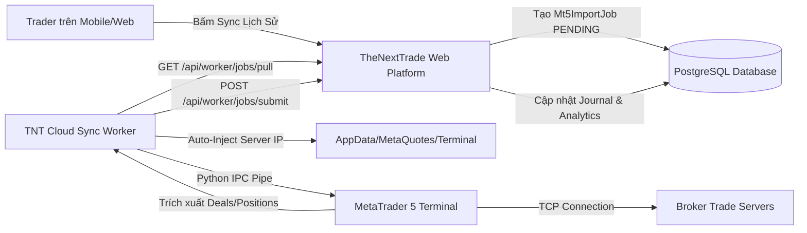

# TheNextTrade — MT5 Cloud Sync Worker & Desktop Assistant

> **Kiến trúc, Nguyên lý hoạt động và Hướng dẫn triển khai cho ứng dụng Python MT5 Telemetry Worker**

---

## 1. Mục Đích Ra Đời & Bài Toán Giải Quyết

### 1.1 Bài toán thực tế của Trader
* Đại đa số các nhà giao dịch Forex/Vàng sử dụng điện thoại di động (iPhone/Android), máy tính bảng (iPad) hoặc máy Mac (macOS).
* Nền tảng MetaTrader 5 (MT5) trên điện thoại và macOS không hỗ trợ Expert Advisor (EA) hoặc thư viện Python IPC để truyền dữ liệu giao dịch trực tiếp lên web.
* Trader không thể và không muốn duy trì một máy tính Windows chạy 24/7 chỉ để mở phần mềm MT5.

### 1.2 Giải pháp TheNextTrade Cloud Sync Worker
* **TheNextTrade Worker** là một ứng dụng client chuyên biệt chạy trên Windows (Laptop cá nhân, PC văn phòng hoặc Cloud VPS giá rẻ).
* Ứng dụng hoạt động như một **cầu nối tự động (Telemetry Bridge)**:
  1. Nhận lệnh đồng bộ (Sync Job) từ Web Platform TheNextTrade qua REST API.
  2. Sử dụng **Mật khẩu Nhà đầu tư (Investor Password - Read-Only)** để đăng nhập ngầm vào tài khoản MT5 của người dùng.
  3. Trích xuất toàn bộ lịch sử giao dịch (Deals/Orders), trạng thái lệnh đang mở (Open Positions), số dư (Balance), vốn thực tế (Equity), đòn bẩy (Leverage), loại tiền tệ (Currency).
  4. Đẩy toàn bộ dữ liệu về máy chủ TheNextTrade để phân tích rủi ro, chấm điểm thói quen giao dịch và cấp quyền Pro/VIP.
  5. **Tuyệt đối an toàn**: Chỉ dùng Investor Password (chỉ xem, không có quyền đặt lệnh hay rút tiền).

---

## 2. Kiến Trúc Hệ Thống (System Architecture)



### Chi tiết các luồng giao tiếp:
1. **Web Platform ↔ Worker (REST API / HTTPS)**:
   - Worker định kỳ (mặc định 10 giây/lần) gọi endpoint `GET /api/worker/jobs/pull` với `x-worker-key` để nhận job mới.
   - Khi có job, Web Platform khóa job đó trong 5 phút (`leaseExpiresAt`) để tránh trùng lặp giữa nhiều worker.
   - Sau khi đọc xong lịch sử, Worker gọi `POST /api/worker/jobs/submit` để trả kết quả.
   - Nếu gặp sự cố, Worker gọi `POST /api/worker/jobs/fail` để ghi nhận mã lỗi và mở khóa hàng đợi.
2. **Worker ↔ MetaTrader 5 (Local IPC Protocol)**:
   - Giao tiếp qua Named Pipe / Shared Memory do thư viện chính thức `MetaTrader5` cung cấp.
   - Không cần mở port mạng, không cần cài đặt thêm plugin bên thứ ba.
3. **MetaTrader 5 ↔ Broker Network (TCP)**:
   - MT5 kết nối đến server của sàn giao dịch (Startrader, Exness, Vantage, v.v.) qua cổng mặc định 443/1950.

---

## 3. Đột Phá Kỹ Thuật: Pre-bundled Servers Pack

### 3.1 Nguyên nhân gốc rễ của lỗi IPC Timeout (-10005)
Trước đây, khi Worker chạy trên máy tính cài đặt MT5 từ một sàn cố định (ví dụ sàn Vantage), tệp dữ liệu mạng `config/servers.dat` của MT5 chỉ chứa địa chỉ IP của riêng sàn Vantage.

Khi Worker nhận job đồng bộ một tài khoản ở sàn khác (ví dụ Startrader `STARTRADERFinancial-Demo`), hàm `mt5.login()` gửi yêu cầu kết nối tới một server chưa có trong danh bạ MT5. Khi đó:
* MT5 mở hộp thoại tìm kiếm broker ngầm trên giao diện.
* Luồng IPC giữa Python và MT5 bị đóng băng (deadlock).
* Sau 60–120 giây, hàm gọi trả về lỗi: `(-10005, 'IPC timeout')`.
* Trader buộc phải dùng chuột mở MT5, bấm *File -> Open an Account*, gõ tìm tên sàn bằng tay thì Worker mới chạy được.

### 3.2 Giải pháp Pre-bundled Servers Pack
Worker được tích hợp sẵn gói **Pre-bundled Servers Pack** (`tools/tnt-worker/servers_pack/`):
* **Master Server Catalog (`servers.dat`)**: Tệp danh mục mạng 554 KB chứa toàn bộ IP và điểm truy cập (Access Points) của hàng trăm sàn Forex phổ biến trên thế giới.
* **Broker Bases Configurations**: Cấu hình base sạch (chỉ giữ `tickers.dat`, lược bỏ toàn bộ tick và chart cache nặng hàng trăm MB) cho các sàn:
  - `STARTRADERFinancial-Demo`, `STARTRADERFinancial-Live 6`
  - `Exness-MT5Real20`, `Exness-MT5Real25`, `Exness-MT5Real36`, `Exness-MT5Trial14`, `Exness-MT5Trial17`
  - `TradeMaxGlobal-Live`
  - `UltimaMarkets-Live 1`
  - `VTMarkets-Demo`
  - `VantageInternational-Demo`, `VantageMarkets-Live`
* **Cơ chế nạp tự động (Zero-Config Auto-Provisioning)**:
  - Khi nhận job, hàm `ensure_broker_server_available()` quét tìm tất cả thư mục MT5 Roaming Data trong `%APPDATA%\MetaQuotes\Terminal\*`.
  - Nếu tệp `servers.dat` của terminal đang ở trạng thái sơ khai (< 150 KB), Worker sẽ tự động sao lưu bản cũ sang `.bak` và nạp Master Catalog vào.
  - Đồng thời sao chép thư mục `bases/<target_server>` vào terminal.
  - **Kết quả**: MT5 nhận diện sàn ngay lập tức, chuyển đổi mượt mà giữa các tài khoản của nhiều sàn khác nhau mà không bao giờ bị đứng hay timeout.

---

## 4. Vòng Đời Chi Tiết Của Một Job Đồng Bộ (Job Lifecycle)

Mỗi chu kỳ xử lý của hàm `process_job()` tuân thủ nghiêm ngặt 7 bước tuần tự:

```
[1. PULL JOB]  -->  [2. ENSURE SERVER]  -->  [3. IPC INIT]  -->  [4. VERIFY CONNECTION]
                                                                        |
[7. SUBMIT]    <--  [6. EXTRACT DEALS]  <--  [5. LOGIN MT5]  <----------+
```

1. **Bước 1 — Nhận diện yêu cầu (`pull_job`)**:
   - Nhận thông tin: `job_id`, `accountNumber`, `server`, `investorPassword`, `rangeFrom`, `rangeTo`.
2. **Bước 2 — Chuẩn bị hạ tầng mạng sàn (`ensure_broker_server_available`)**:
   - Chuẩn hóa tên server, khử lỗi viết hoa/thường hoặc thiếu hậu tố (ví dụ `STARTRADER-Demo` tự sửa thành `STARTRADERFinancial-Demo`).
   - Nạp IP sàn và base folder vào MT5 nếu chưa có.
3. **Bước 3 — Kết nối IPC sạch (`mt5.initialize`)**:
   - Dọn dẹp trạng thái IPC cũ (`mt5.shutdown()`).
   - Khởi tạo kết nối IPC không mang credentials để tránh lỗi cache session.
4. **Bước 4 — Kiểm tra trạng thái mạng thực tế (`check_mt5_live_connection`)**:
   - Kiểm tra `terminal_info.connected == True`.
   - Kiểm tra `account_info.company != "Unknown"` và `currency != ""` để bảo đảm MT5 đã bắt tay mạng thành công, chống lỗi gửi danh sách 0 deal giả.
5. **Bước 5 — Đăng nhập tài khoản (`mt5.login`)**:
   - Nếu chưa kết nối đúng tài khoản mục tiêu, gọi `mt5.login(login, password, server)`.
   - Thực hiện tối đa 3 lần thử nghiệm (retry), mỗi lần chờ xác thực mạng tối đa 6 giây.
6. **Bước 6 — Trích xuất & Ghép nối dữ liệu giao dịch**:
   - Đọc số dư `balance`, vốn thực tế `equity`, đòn bẩy `leverage` (ví dụ `1:500`), loại tiền tệ `currency` (ví dụ `USD`, `USC` đối với tài khoản Cent).
   - Truy vấn `mt5.history_deals_get(from_dt, to_dt)`.
   - Lọc bỏ các deals nạp/rút tiền (`DEAL_TYPE_BALANCE`).
   - Ghép cặp các deal vào lệnh (`DEAL_ENTRY_IN`) và deal đóng lệnh (`DEAL_ENTRY_OUT`) theo `position_id` thành một Position hoàn chỉnh gồm: giá vào, giá ra, thời gian mở/đóng, lot size, swap, commission, profit.
   - Quét các vị thế đang mở qua `mt5.positions_get()`.
7. **Bước 7 — Trả kết quả về Web Platform (`submit_deals`)**:
   - Gửi payload JSON lên máy chủ.
   - Máy chủ TheNextTrade tự động chuẩn hóa Lot đối với tài khoản Cent (100 lot cent = 1 standard lot) và lưu vào cơ sở dữ liệu.
   - Đánh dấu job `COMPLETED` và giải phóng kết nối MT5.

---

## 5. Hai Chế Độ Vận Hành (Operating Modes)

Ứng dụng hỗ trợ 2 chế độ linh hoạt:

### 5.1 Giao diện Desktop GUI (Mặc định khi click đúp)
* Được xây dựng trên nền tảng **Tkinter (Dark Theme)** tương thích tuyệt đối với mọi phiên bản Windows 10/11:
  - **Header & Telemetry Monitor**: Hiển thị trực quan tài khoản đang sync (`#1610076507`), Server (`STARTRADERFinancial-Demo`), Mật khẩu, Chế độ sync và Bước xử lý hiện tại.
  - **Form cấu hình trực tiếp**:
    - `API_BASE_URL`: Địa chỉ web platform (ví dụ `https://thenexttrade.com` hoặc `http://localhost:3000`).
    - `WORKER_KEY`: Khóa bảo mật của Worker.
    - `WORKER_ID`: Tên định danh máy (ví dụ `laptop-kee-01`).
    - `POLL_INTERVAL`: Tần suất kiểm tra job (mặc định 10 giây).
    - `Custom MT5 Path`: Tùy chọn đường dẫn đến file `terminal64.exe` nếu máy cài nhiều bản MT5.
  - **Huy hiệu Servers Pack**: Báo xanh `📦 Servers Pack: Active (12 Brokers)` khi bộ nạp sàn sẵn sàng.
  - **Console Log thời gian thực**: Khung log màu phân loại INFO, WARNING, ERROR có thể cuộn và copy nhật ký lỗi.

### 5.2 Chế độ Headless CLI (Dành cho VPS / Server ngầm)
Chạy bằng tham số `--headless`:
```powershell
.\TNT-Cloud-Sync-Worker.exe --headless
```
* Không hiển thị cửa sổ đồ họa.
* Toàn bộ log xuất trực tiếp ra stdout/stderr.
* Thích hợp chạy ngầm dưới dạng **Windows Service** hoặc cấu hình tự khởi động cùng hệ thống qua **Windows Task Scheduler**.

---

## 6. Cấu Trúc Thư Mục & Tệp Tin

```
tools/tnt-worker/
│
├── worker.py                    # Mã nguồn chính của Worker (GUI + Core Logic)
├── requirements.txt             # Danh sách thư viện Python cần thiết
├── build_exe.bat                # Script tự động biên dịch thành file .exe độc lập
├── TNT-Cloud-Sync-Worker.spec   # Cấu hình PyInstaller đóng gói kèm tài nguyên
│
├── servers_pack/                # Gói tài nguyên nạp sàn tự động
│   ├── servers.dat              # Master Access Points Catalog (554 KB)
│   ├── servers_manifest.json    # Chỉ mục ánh xạ tên sàn, server và alias
│   └── bases/                   # Thư mục cấu hình server sạch của các broker
│       ├── STARTRADERFinancial-Demo/
│       ├── Exness-MT5Real20/
│       ├── VantageMarkets-Live/
│       └── ...
│
└── dist/
    └── TNT-Cloud-Sync-Worker.exe # File nhị phân độc lập sẵn sàng chạy (25.1 MB)
```

---

## 7. Hướng Dẫn Triển Khai Trên Máy Tính Mới (Deployment Guide)

Để triển khai Worker trên một laptop hoặc Cloud VPS Windows mới:

### Bước 1: Chuẩn bị máy trạm
1. Cài đặt bất kỳ phiên bản MetaTrader 5 nào trên máy tính (chỉ cần cài đặt, không cần đăng nhập sẵn tài khoản).
2. Đảm bảo máy tính có kết nối Internet đến Web Platform TheNextTrade.

### Bước 2: Khởi chạy Worker
1. Sao chép file thực thi:
   `tools/tnt-worker/dist/TNT-Cloud-Sync-Worker.exe`
2. Tạo file cấu hình `config.json` cạnh file `.exe` (hoặc mở app lên nhập trực tiếp trên giao diện rồi bấm **Save Settings**):
   ```json
   {
     "api_base_url": "https://your-domain.com",
     "worker_key": "tnt-worker-secret-key-2026",
     "worker_id": "vps-worker-01",
     "poll_interval": 10,
     "mt5_path": "",
     "auto_start": true
   }
   ```
3. Bấm **Start Worker**. Worker sẽ tự động chuyển sang trạng thái chờ lệnh và xử lý mọi tài khoản của trader được gửi từ website.
